## Ghost: Forensics

**Description:** The interception of a transmission has occurred, with only a network capture remaining. Recover the flag before the trail goes cold. (The challenge was updated with different files during the CTF)

We were given a PNG file `wallpaper.png`, so I made my initial examinations:  
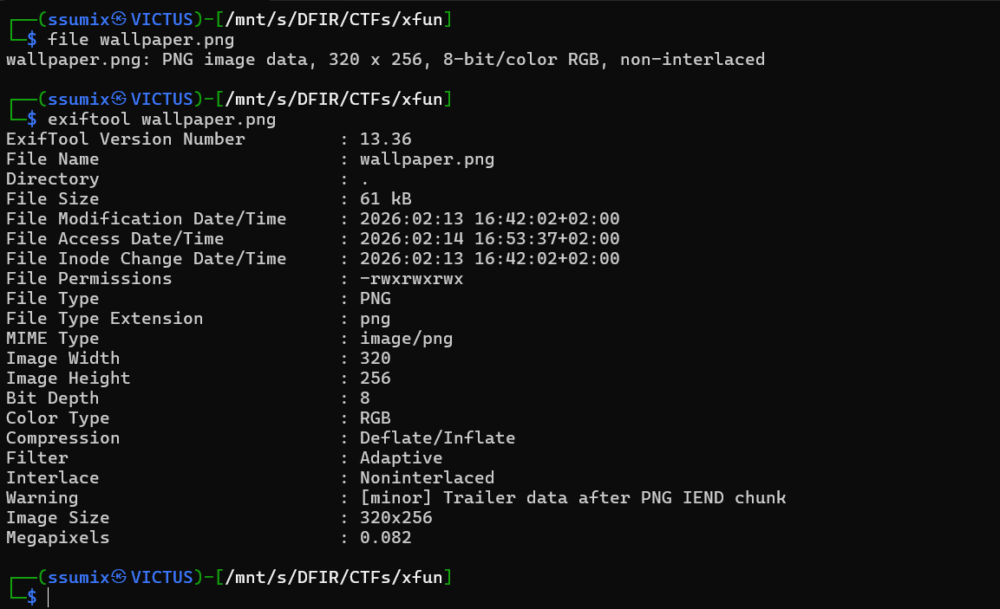

I noticed the `Trailer data after PNG IEND chunk` warning in `exiftool`'s output, which indicated that there's either embedded files or steganography. My next step was examining the file for stego:  
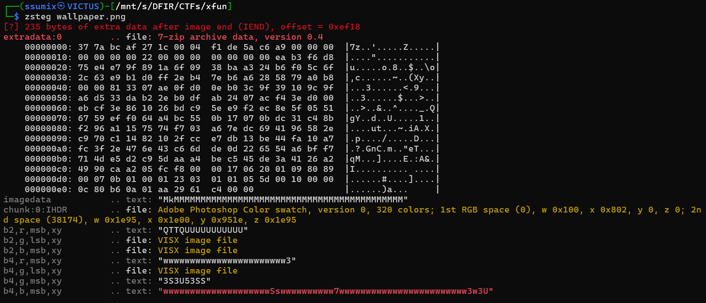

`zsteg`'s output made it obvious that there's an embedded 7z archive in this image, so I used `binwalk` to extract it:  
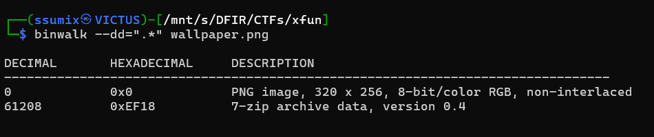

Then I extracted the archive using 7z, but was asked for a password:  
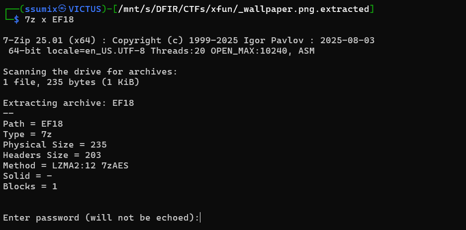

I had noticed earlier that the image had this weird text `1n73rc3p7_c0nf1rm3d`, and I kept it noted to be used later. The most logical approach was to try it as the password, and it was correct!

Then I moved to the `/fishwithwater` directory, and the flag was there in a file named `nothing.txt`:  
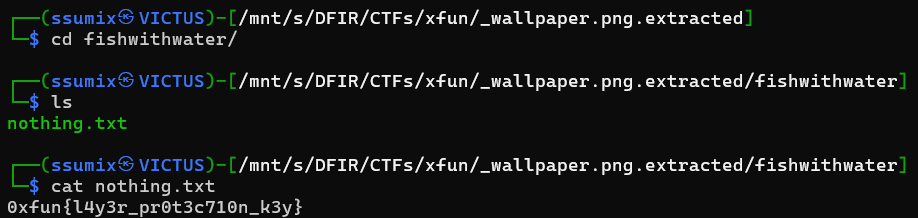

---

## Kd: Forensics

**Description:** Something crashed. Something was left behind.  

We were given these files:  
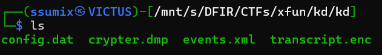

I first examined the `crypter.dmp`, which seemed to be a **Windows MiniDump** file. It contains the application’s memory data at the moment it crashed, as the description indicates.

My first step was checking any text in this file using `strings` and grepping the flag format `0xfun`, which surprisingly showed the flag (unintended solution):  
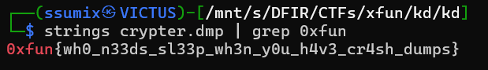

---

## Tesla: Forensics

**Description:** Flipper Zero, often referred to as a hacking device, is designed to capture frequencies and execute commands. It's considered a risky tool to have, as it is illegal in some countries. Perfect. We’ll keep the same flow and just naturally include the script where it fits — like you actually used it while solving.

We were given a file named `Tesla.sub`, and since `.sub` files are usually related to Flipper Zero Sub-GHz captures, I initially assumed this would involve analyzing RF data or decoding some captured transmission.

I started with basic inspection:  
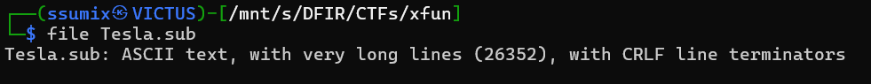

It turned out to be ASCII text, which was unusual because real RAW Sub-GHz captures normally contain timing values, not clean binary-looking text. I opened the file and saw:

```text
Filetype: BadUsb 0xfun
Version: 1
Frequency: 433920000
Protocol: RAW
RAW_Data: 11111111 11111110 00100110 ...
````

The `RAW_Data` section consisted entirely of 8-bit binary values separated by spaces. Instead of treating it as radio data, I extracted the RAW values and converted each 8-bit chunk to ASCII. The result wasn’t signal data; it was a Windows batch script!

Inside the decoded content, I saw:

```batch
set "Il�c=pesbMUQl73oWnqD9rAvFRKZaf0hO5@dBN4uSzCtGjE YxITwXiVm1Jcgy26LkH8P"
```

Followed by patterns like:

```batch
%IlXc:~29,1%
%IlXc:~1,1%
%IlXc:~54,1%
```

This is a classic batch obfuscation method. In Windows batch:

```batch
%variable:~start,length%
```

Extracts a substring, so the script defines a long string and rebuilds another command character by character using specific indexes.

Instead of manually resolving every index, I parsed the offsets and reconstructed the hidden string, which revealed a long hex string:

```text
5958051a1b170013520746265a0e51435b36165752470b7f03591d1b364b501608616e
```

I converted it from hex to ASCII directly, but it was unreadable (clearly encrypted).

So I went back to the batch script and looked carefully; there were readable phrases inside it, including:

```text
i could be something to this
```

I immediately thought that this could be the key used in XORing this hex string. Here’s the script I used:

```python
hex_str = "5958051a1b170013520746265a0e51435b36165752470b7f03591d1b364b501608616e"

cipher = bytes.fromhex(hex_str)
key = b"i could be something to this"

result = bytearray()

for i in range(len(cipher)):
    result.append(cipher[i] ^ key[i % len(key)])

print(result.decode())
```

After running it, the output was clean ASCII and revealed the flag:

```text
0xfun{d30bfU5c473_x0r3d_w1th_k3y}
```

---

## Nothing Expected: Forensics

**Description:** None

We were given a PNG file, so I did my initial investigations:  
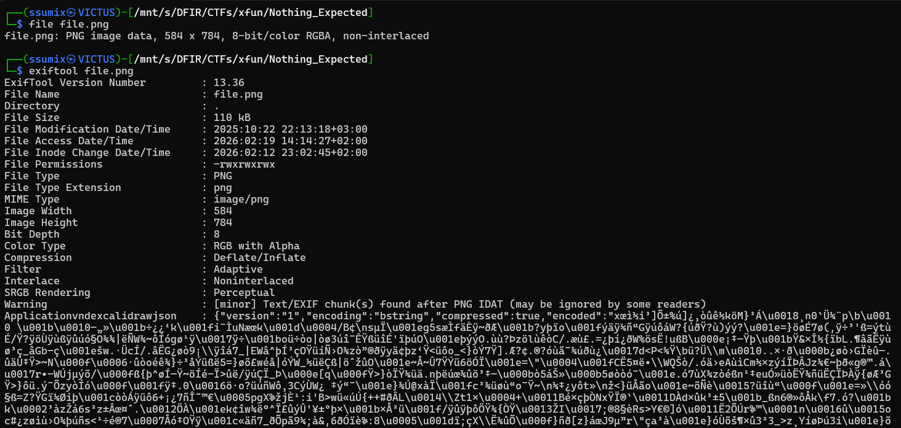

I noticed the `Applicationvndexcalidrawjson` output in the photo's meta-data, which is basically the internal JSON format that [Excalidraw](https://excalidraw.com/) uses to save its drawings. I imported the given photo and got the flag:  
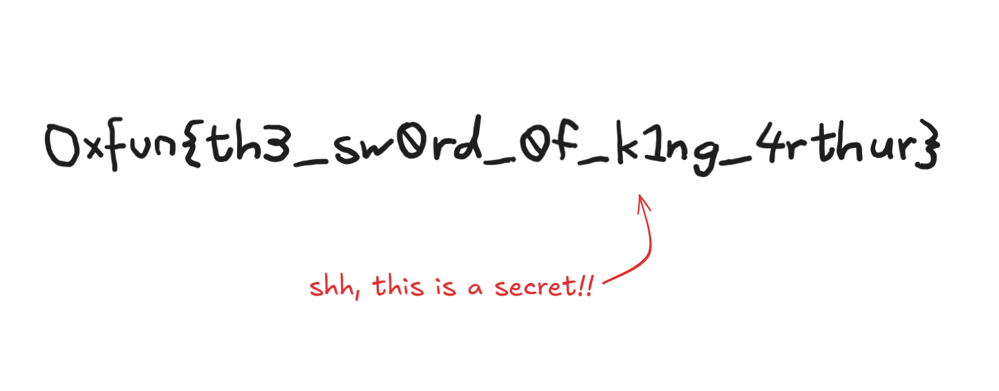

---

## DTMF: Forensics

**Description:** None

We were given a `.wav` file. After listening to it and considering the challenge's name, it was clear that it was a DTMF message. I decoded it using an online [DTMF decoder](https://dtmf.netlify.app/):

```text
Decoded: 010011010100100001001010011101000101101000110010011100000011011101010110010010000101010101111000011000100101010001000110011001100101100101101010010100100110111101011000001100100110110001111010010110010111101001010110011001100110010001101101001101010011000001100011011011100011000000111101
```

I converted this binary into ASCII and noticed that the output was Base64:  
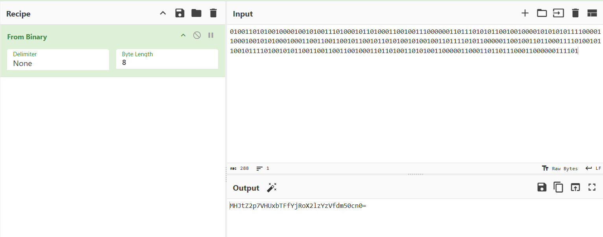

After decoding Base64, I noticed the output was probably shifted characters (the 0 and {} of the flag format were there). I tried all possible Caesar Cipher rotations, but none worked.
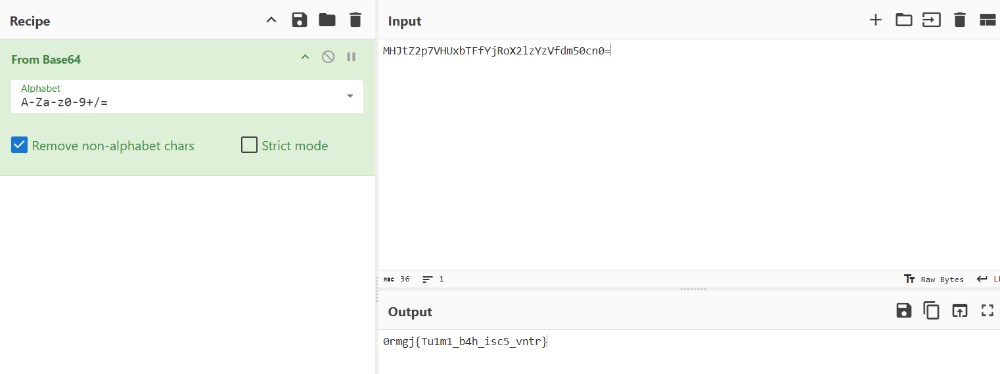
My next option was Vigenère Cipher, but the key was unknown. Instead of brute-forcing, I rechecked the file for hidden text using `exiftool`:  
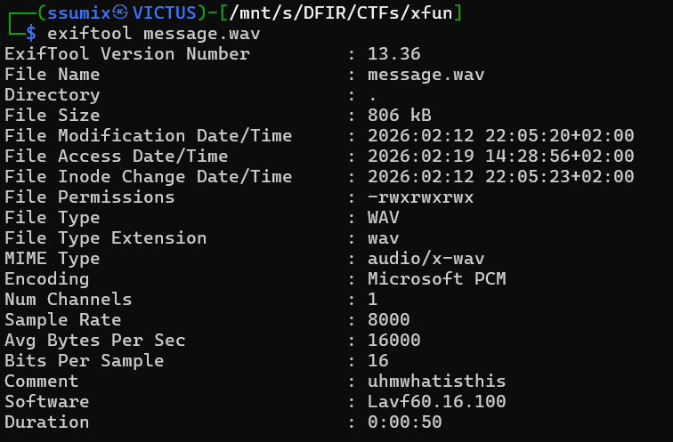

I noticed a weird comment, which I used as a key, and it worked!  
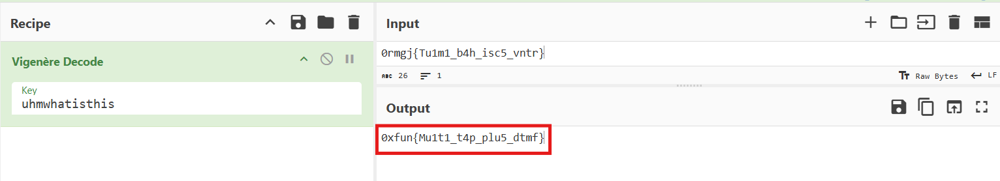

---

And that was all. Don’t forget to check my other write-ups!
