Hey!! This write-up covers the _Egyptian Youth Cybersecurity Challenge (EYCC)_ Ghost in the hall challenge that I managed to solve. This year, forensics challenges were much more challenging and required actual DFIR knowledge to understand and solve, rather than the steganography-focused challenges from last year. My team **Cyb3r_Ph4nt0ms** managed to secure first place in the CTF qualifications, and I was able to solve 2/3 forensics challenges during the CTF :>

Let's get started!

---

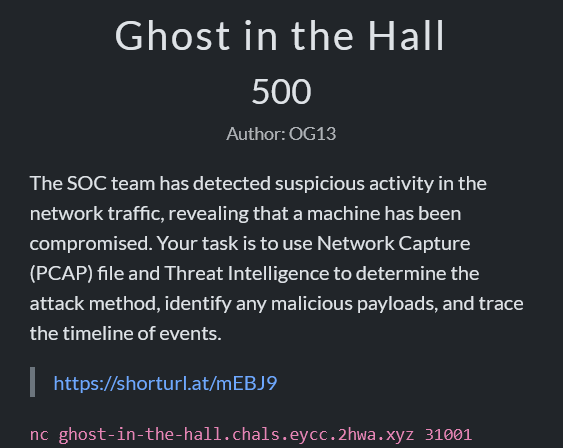

We were given a single pcap, `2026-02-28-traffic-analysis-exercise.pcap`, so my first move was just to pop it open and sift through the traffic before viewing any question

### Q1: What is the IP address of the compromised workstation?

Since the goal was to identify the compromised workstation, I first wanted to see which hosts were communicating the most throughout the capture, so after loading the pcap in `Wireshark` I checked the conversations list and noticed a single IP sending and receiving traffic throughout the capture

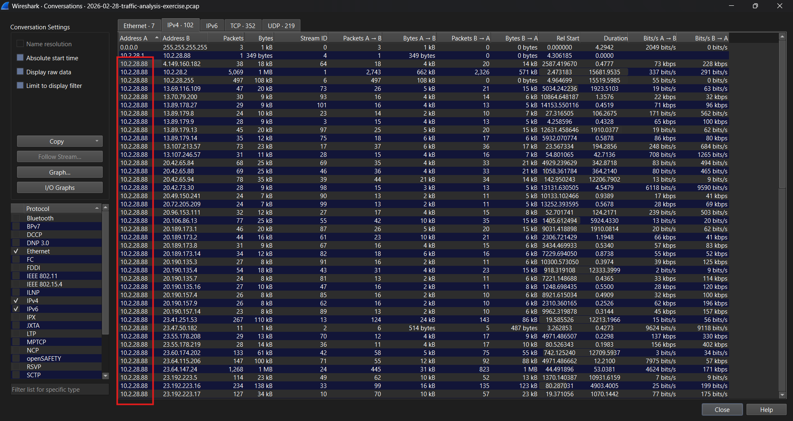

Since it was communicating consistently with multiple hosts, it was clearly the compromised workstation

**Answer:** `10.2.28.88`

### Q2: What is the Command & Control IP address and port? (format: IP:Port)

Soooo I checked the protocol hierarchy to understand the flow of the requests and I noticed that most of the traffic was mainly http

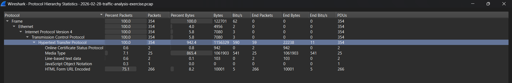

then I filtered for http and I noticed abnormal activity from the IP `45.131.214.85`. It keeps sending repeated requests to a weird destination: http://45.131.214.85/fakeurl.htm at a fixed rate 

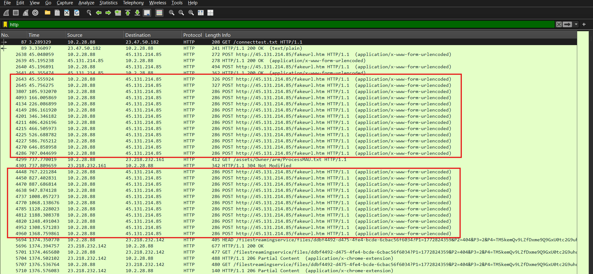

I then followed the http stream and noticed it was actually running over port `443`

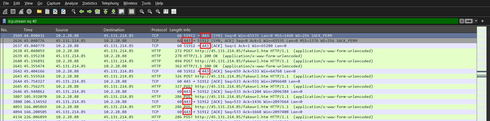 
**Answer:** `45.131.214.85:443`

### Q3: What User-Agent does the malware use for beaconing?

I checked the header of one of the repeated requests from the malicious IP, and the User-Agent was sitting right there in plain text

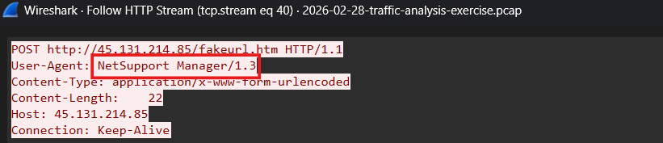

`NetSupport Manager/1.3` immediately jumped out since NetSupport Manager is a legit remote-support tool that's been getting abused as a RAT for years now, and its beacons are pretty recognizable once you've seen one.

**Answer:** `NetSupport Manager/1.3`

### Q4: What server header and OS is the C2 gateway running?

I checked the HTTP responses coming back from `45.131.214.85` for the same beaconing stream, and the `Server` header gave up the gateway software version and OS in one line

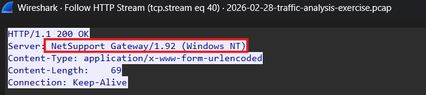

**Answer:** `NetSupport Gateway/1.92 (Windows NT)`

### Q5: What is the beaconing interval used by the malware? (in seconds)

I lined up the timestamps of consecutive `POST /fakeurl.htm` requests to the C2 and the gaps were consistent:

```
19:55:51.530968  <- initial handshake burst (4 requests inside ~1s, setting up the session)
19:55:51.679800
19:55:52.038833
19:55:52.239184
19:56:52.414979  -> +60.18s
19:57:52.488778  -> +60.07s
19:58:52.569808  -> +60.08s
19:59:52.644829  -> +60.08s
20:00:52.829091  -> +60.18s
20:01:52.909105  -> +60.08s
20:02:52.988882  -> +60.08s
20:03:53.171691  -> +60.18s
20:04:53.248121  -> +60.08s
20:05:53.341867  -> +60.09s
20:06:53.527608  -> +60.19s
```

So there's a little burst of setup traffic right at the start (that's the session negotiation, not the actual beacon loop), and then once the real check-in cadence kicks in at `19:56:52`, every single gap rounds to 60 seconds, give or take ~100-200ms of jitter which is just normal network/processing latency, not the malware actually varying its sleep timer.

**Answer:** `60`

### Q6: When did the first C2 beacon occur? (UTC, format: YYYY-MM-DD HH:MM:SS)

I checked the stream again and just grabbed the timestamp on the very first `POST /fakeurl.htm` request header

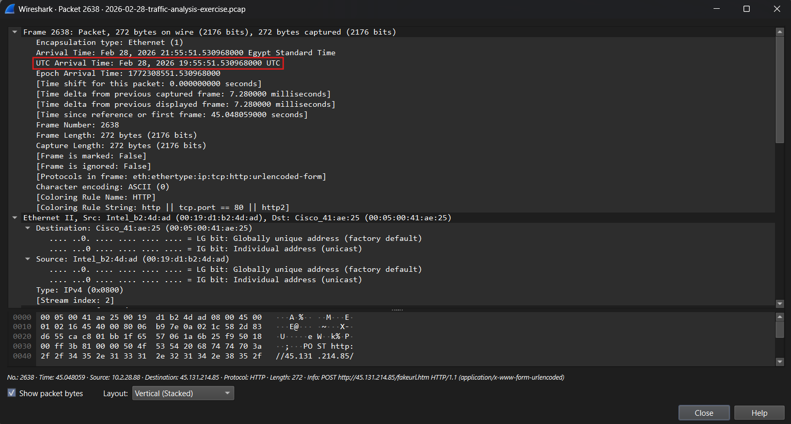

**Answer:** `2026-02-28 19:55:51`

### Q7: What is the SHA256 of the second executable?

This is where the pcap stopped cooperating :0 My first instinct was to export every HTTP object in the capture (`File > Export Objects > HTTP`) and check each one for a PE header and nothing came back

I also grepped the raw TCP payloads across the whole capture for the `"This program cannot be run in DOS mode"` string, which would catch an executable even if Wireshark didn't reassemble it as a clean HTTP object. Still nothingg

So the conclusion was: the actual executable download never happened inside this capture window. The infection had already landed before the pcap started recording and all we're seeing here is the post-infection beaconing.

I searched the malicious IP in [VirusTotal](https://www.virustotal.com/gui/home/search)

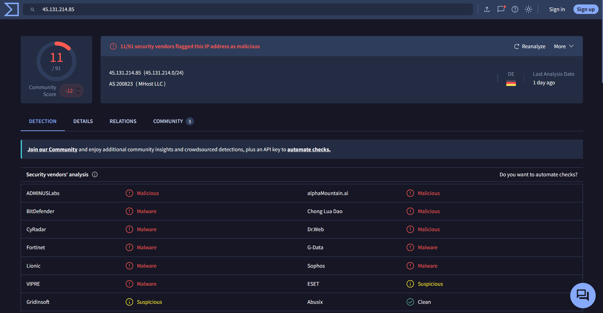

Then after checking the community field I found this comment claiming this IP was flagged as an IOC on [ThreatFox](https://threatfox.abuse.ch/ioc/1755776/)

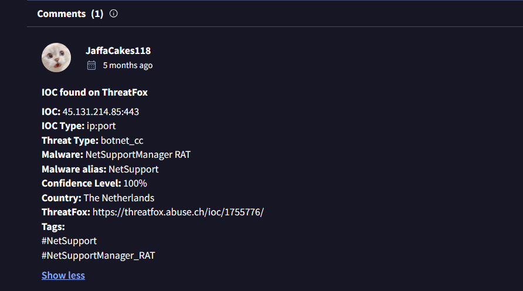

After checking the link I found the sha256 of the 2nd malware in the malware samples table

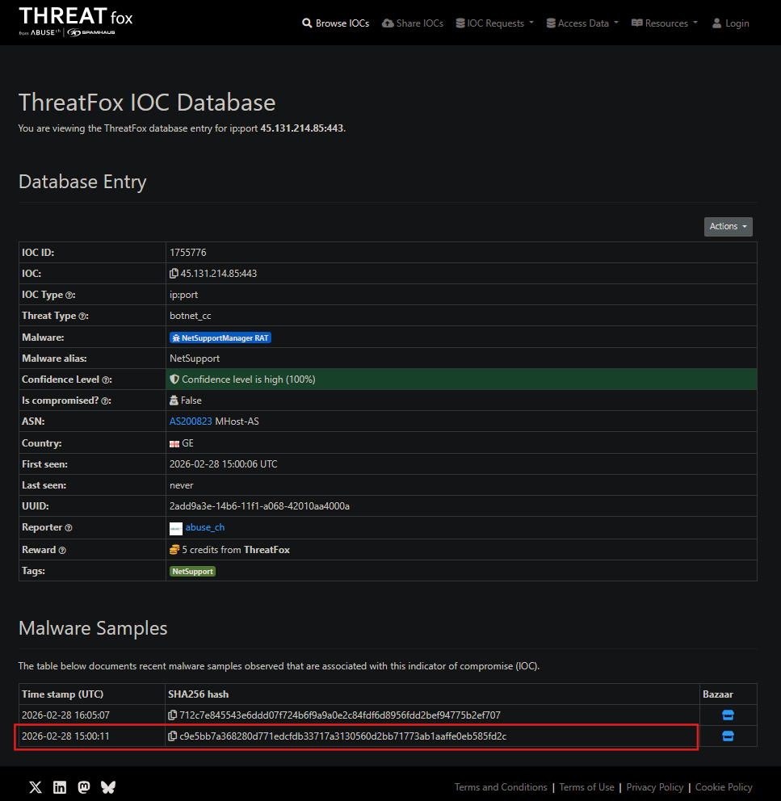

**Answer:** `c9e5bb7a368280d771edcfdb33717a3130560d2bb71773ab1aaffe0eb585fd2c`

### Q8: What is the malware detection label based on the ESET-NOD32 AV?

With the hash in hand, I headed straight to VirusTotal then checked the detection tab, and scrolled the vendor list down to ESET-NOD32

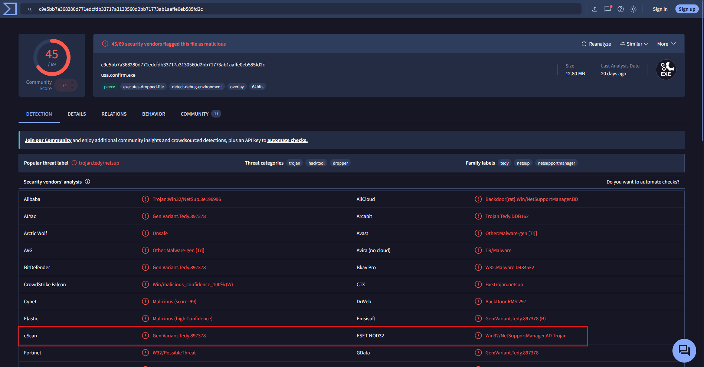

**Answer:** `Win32/NetSupportManager.AD Trojan`

### Q9: What is the timestamp for the malware's creation? (UTC, format: YYYY-MM-DD HH:MM:SS)

I headed to the Details tab and checked its history where the creation time was clearly stated

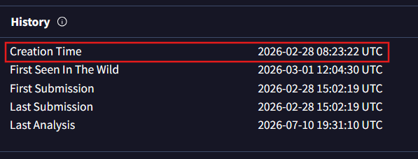

**Answer:** `2026-02-28 08:23:22`

### Q10: As part of VM evasion, what Windows registry key did the malware query to detect VMware?

I moved to the Behavior tab, where VT logs sandbox execution details (VT ran this sample through Zenbox, CAPE, Dr.Web vxCube, and a few others).

Scrolled down to `Shell commands` and the sample was doing a two-pronged VM check: a pile of PowerShell + WMI queries (`Win32_ComputerSystem`, `Win32_BIOS`, `Win32_DiskDrive`, `Win32_NetworkAdapter`) fishing for manufacturer/model strings like "VMware" or "VirtualBox", plus one direct registry query sitting right in the command list:

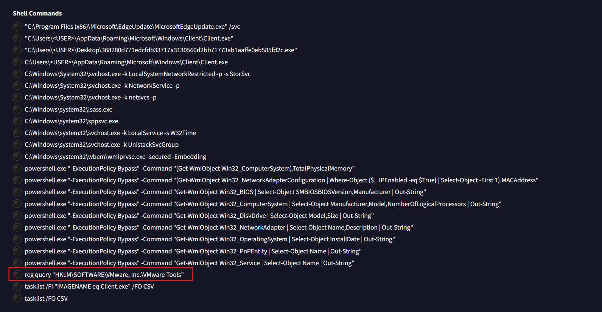

That key only exists on machines that actually have the VMware Tools guest additions installed, so querying it is a quick, cheap "am I running inside a VM" check before the malware commits to running its real payload

**Answer:** `HKLM\SOFTWARE\VMware, Inc.\VMware Tools`

---

And that was all, hope you enjoyed this writeup!! :>