Hey!! This write-up covers the _Egyptian Youth Cybersecurity Challenge (EYCC)_ Trust Issue Forensics challenge that I managed to solve. This year, forensics challenges were much more challenging and required actual DFIR knowledge to understand and solve, rather than the steganography-focused challenges from last year. My team **Cyb3r_Ph4nt0ms** managed to secure first place in the CTF qualifications, and I also got the first blood, and the only solve, on this hard forensics challenge :>

Let's get started!

---

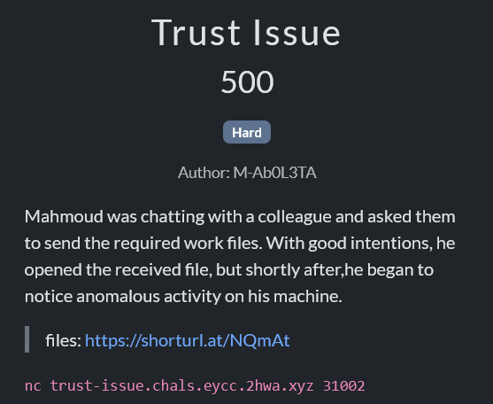

We were given a C folder and two log files, so my first step was to load them in `Autopsy` to start my investigation

### Q1: The victim interacted with the threat actor on a specific chat platform to receive a requested document. What is the name of this communication application?

After loading the challenge files I noticed that there was web activity from the huge amount of web cache and web history, so I checked the web cache artifact and found multiple requests to discord.com

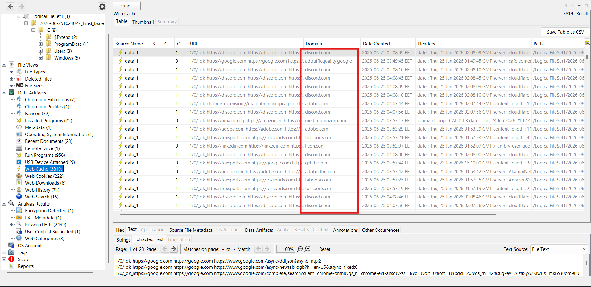

Then I checked the web history artifact which confirmed that discord was used in communication

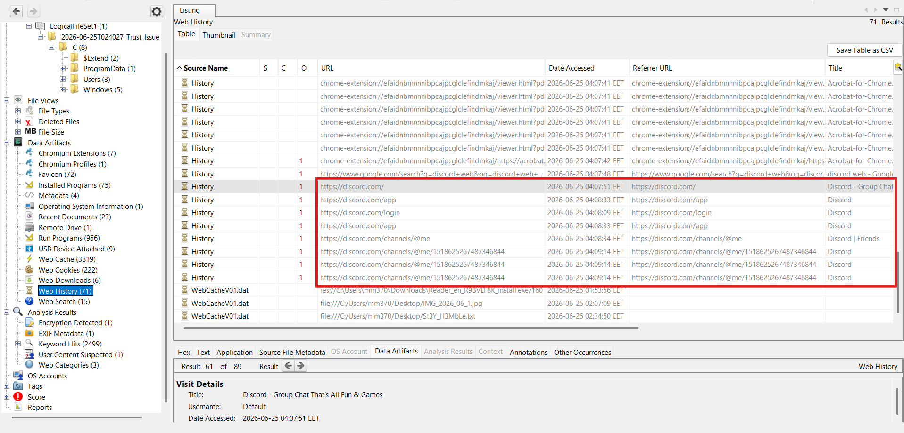

**Answer:** `discord`

### Q2: What is the ID of the conversation between the attacker and the victim?

From the web history artifact we can see that only one discord chat link was visited which had the chat ID of the conversation

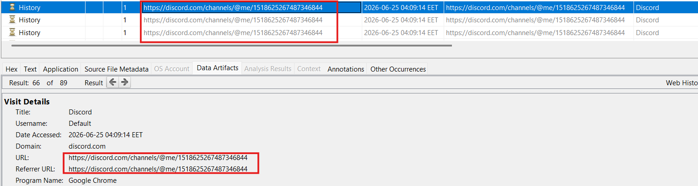

**Answer:** `1518625267487346844`

### Q3: The attacker mentioned the password used to unzip the folder containing that malicious pdf, what is the used password?

My first thought was searching all files for the chat ID since the password almost definitely existed in the browser artifacts, and my suspicion was confirmed after viewing the content of `C/Users/mm370/AppData/Local/Google/Chrome/User Data/Default/Cache/Cache_Data/data_2/data_2__b10232da/data_2__b10232da/0` which is a cached Chrome browser data file recovered from the user's profile that contains serialized JSON data from a Discord conversation that Chrome stored locally, including message contents, timestamps, sender information, attachment metadata, and URLs 

Examining the cached data revealed both the password shared in the chat and the metadata for the attached `Nexora_Documents.7z` archive, making it a valuable source of forensic evidence even without accessing Discord directly

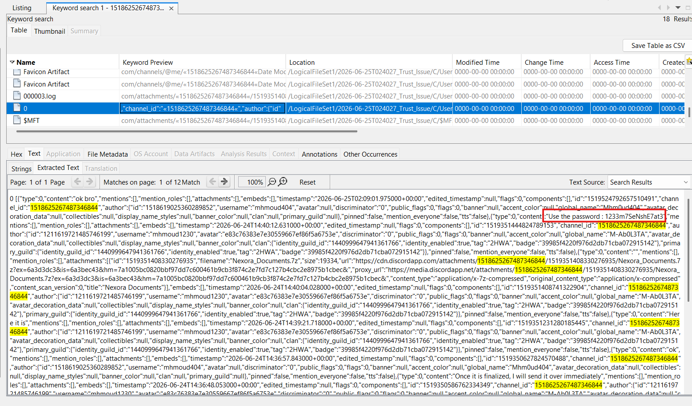

**Answer:** `1233m7SeNshE7at3`

### Q4: The victim reported that upon double-clicking the supposed HR document a Command Prompt window briefly flashed on the screen before the document opened. What is the exact name of the hidden batch script that was executed via the command line arguments?

I decided to check the `Downloads` folder for the downloaded malicious document before checking any prefetch or evtx logs and found `C/Users/mm370/Downloads/Nexora Documents/Nexora_HR.pdf.lnk` and viewing its strings revealed that a batch script located under `/c _hidden` is the intended file waiting to be executed

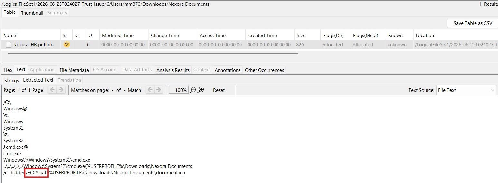

**Answer:** `ECCY.bat`

### Q5: What is the name of the legitimate binary (LOLBin) that the attacker utilized to deliver the malicious payload onto the compromised system?

For this question I decided to check prefetch files for a clear timeline of what was executed, so I used the `PECmd` tool to extract the prefetch files into a clean csv and then view it in `TimeLineExplorer` using this command:

```shell
./PECmd.exe -d "path\to\prefetch" --csv out --csvf prefetch.csv
```

and the tool outputted two files: `prefetch.csv` and `prefetch_Timeline.csv`

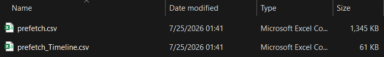

Once I had both csvs loaded up in `TimelineExplorer`, I scrolled through looking for anything weird around the time the user opened the malicious PDF, and noticed that the chain looked something like this:

```Timeline
02:09:51  7ZG.EXE                  -> extracting the archive from the phishing email
02:10:55  ACROBAT.EXE              -> victim opens the PDF lure
02:10:57  csc.exe / cvtres.exe     -> .NET compiling on the fly (sus)
02:14:25  cmd.exe -> powershell.exe -> csc.exe/cvtres.exe again
02:24:25  CURL.EXE                 -> !!
02:27:57  sc.exe                   -> service getting created (persistence)
```

That `CURL.EXE` entry immediately jumped out as it's sitting right after all the PowerShell/csc.exe weirdness and right before a service gets created, which indicates that this is where the payload actually got pulled down

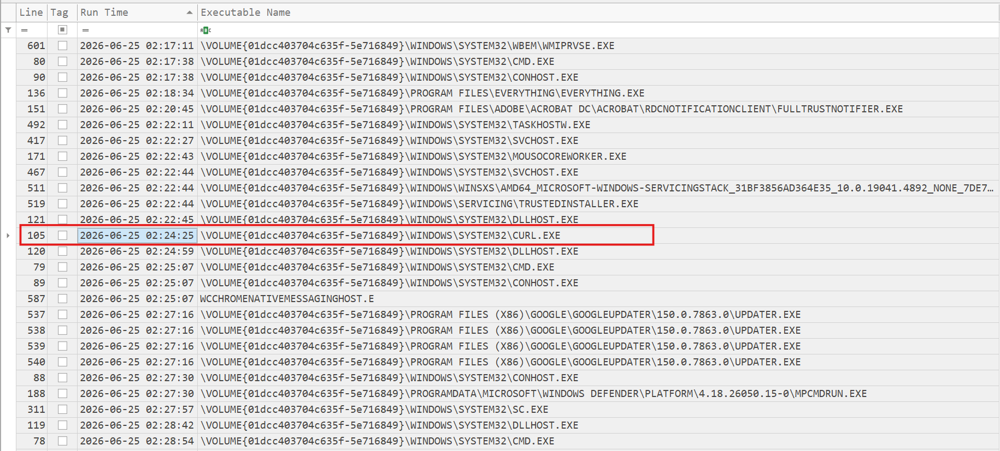

So basically: curl.exe is the LOLBin, a legit, signed Windows binary that got repurposed to download the malicious payload onto the box instead of the attacker having to drop their own downloader which would've been way easier for AV to catch

**Answer:** `CURL.exe`

### Q6: What is the full path of the delivered malicious Payload?

I checked the `Files Loaded` list in the prefetch of `CURL.exe`, and sitting right next to the normal networking DLLs (`WS2_32.DLL`, `CRYPT32.DLL`, etc) was `ADMIN.EXE`, a System32 Windows binary and it has no prefetch history of its own before this, so that's certainly the malicious payload curl fetched

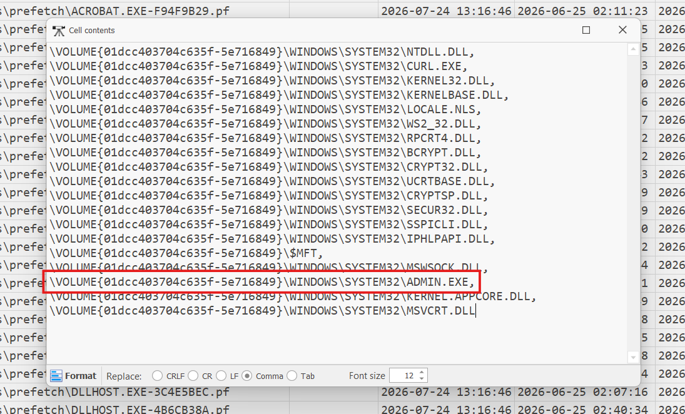

**Answer:** `C:\Windows\System32\ADMIN.exe`

### Q7: The attacker established a persistence mechanism to automatically trigger the delivered payload. What is the name of the component responsible for this execution?

For this one I went into `Autopsy` and searched for the string `ADMIN.exe` across the disk image to see where else it showed up outside of prefetch, and that path took me into the `SYSTEM` registry hive.

Since the live `SYSTEM` hive can be behind on what actually happened, I also checked `SYSTEM.LOG1` (the transaction log) to catch anything that hadn't been fully committed/flushed yet, and that's where I found it, right above the `ADMIN.exe` reference was a key called:

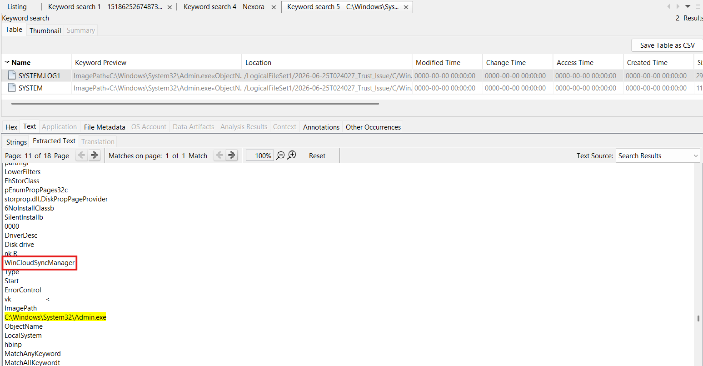

Digging into that key, its `ImagePath` value pointed straight at: `C:\Windows\System32\admin.exe`

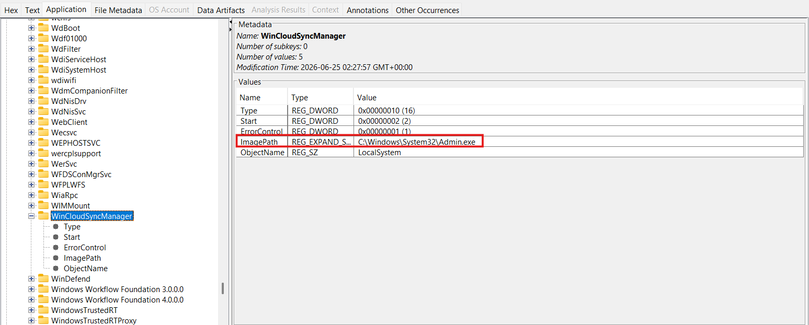

So `WinCloudSyncManager` is a fake Windows service the attacker registered under the `SYSTEM\CurrentControlSet\Services\` hive, using a name designed to blend in with legit background sync/cloud services so it wouldn't stick out in `services.msc` or Task Manager, and its `ImagePath` is set to launch `ADMIN.exe` which is what gives the attacker execution on every boot/service start without needing user interaction again

This also ties back nicely to the prefetch timeline: the `sc.exe` execution at `02:27:57` is almost certainly the moment this service got created (`sc create`/`sc.exe` is the standard CLI for registering a Windows service), right after `curl.exe` grabbed the payload at `02:24:25`

**Answer:** `WinCloudSyncManager`

### Q8: The attacker aimed to establish persistence what is the MITRE ATT&CK ID of the used technique? Format (T****.***)

This question required a bit of research, so I searched "persistence by modifying a windows service mitre att&ck id"


Which led me to [this](https://attack.mitre.org/techniques/T1543/003/) resource that explained the mechanism and specified its MITRE ATT&CK ID

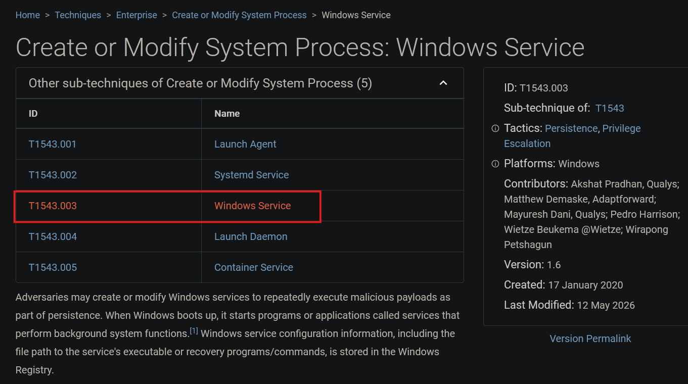

**Answer:** `T1543.003`

### Q9: The attacker left a message for the victim trolling him, Get the main content of that txt file.

I noticed a file from the beginning in the `Desktop` folder with a sus name, `St3Y_H3MbLe.txt`, but it was empty

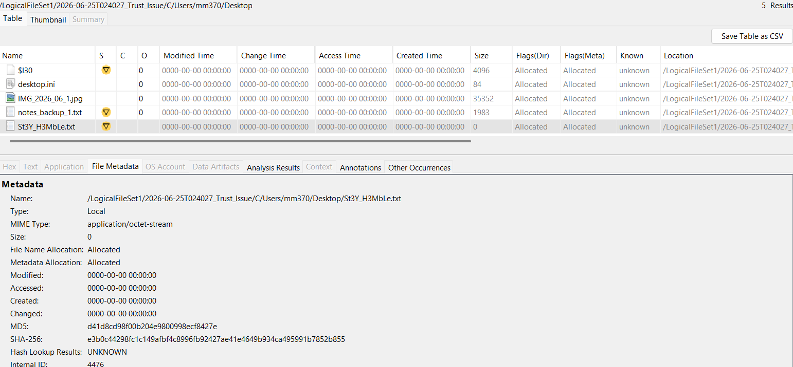

So I went to check the recently opened files to see if it had a `.lnk` file, and it did

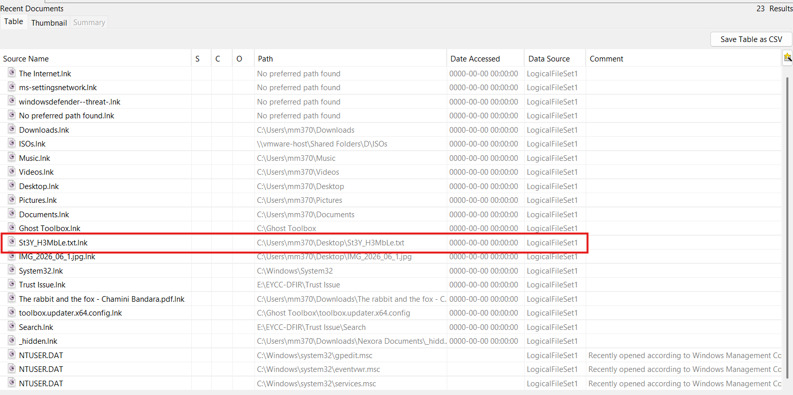

Since the `.txt` file on disk was empty, I figured Windows Search might've indexed its content before it got wiped, so I went looking for `Windows.edb` (the Windows Search index database) and I opened it up in `WinSearchDBAnalyzer` and searched for `St3Y_H3MbLe.txt` by filename. It showed up in the index with a matching `WorkID`, but when I tried to view the actual content column, it was cut off / wouldn't render as the tool just couldn't pull the full text since `Windows.edb` stores large content as an out-of-line "long value" rather than inline, and the GUI tool wasn't handling that properly

So I noted down the `WorkID 432` from `WinSearchDBAnalyzer` and went looking for another way to query the ESE database directly. That's how I landed on [`libesedb-python`](https://pypi.org/project/libesedb-python/), which lets you parse `.edb`/ESE database files in Python and actually reach into those long-value columns properly.

I put together a script that:
- opens the `Windows.edb` file with `pyesedb`
- loops through every table looking for one that has a `WorkID` column
- finds the row matching the `WorkID` I got from `WinSearchDBAnalyzer`
- for each column in that row, checks if it's a "long value" (out-of-line large data) and if so pulls the _actual_ full content instead of just the truncated stub

```Python
#!/usr/bin/env python3
import argparse
import sys

try:
    import pyesedb
except ImportError:
    sys.exit("pyesedb not found. Install with: pip install libesedb-python --break-system-packages")

COLUMN_TYPE_NAMES = {
    0: "NULL",
    1: "BOOLEAN",
    2: "INTEGER_8BIT_UNSIGNED",
    3: "INTEGER_16BIT_SIGNED",
    4: "INTEGER_32BIT_SIGNED",
    5: "CURRENCY",
    6: "FLOAT_32BIT",
    7: "DOUBLE_64BIT",
    8: "DATE_TIME",
    9: "BINARY_DATA",
    10: "TEXT",
    11: "LARGE_BINARY_DATA",
    12: "LARGE_TEXT",
    13: "SUPER_LARGE_VALUE",
    14: "INTEGER_32BIT_UNSIGNED",
    15: "INTEGER_64BIT_SIGNED",
    16: "GUID",
    17: "INTEGER_16BIT_UNSIGNED",
}

def decode_value(record, col_index, col_type):
    """Best-effort decode of a column value to something printable.

    Returns the raw bytes (not a garbled string) if no encoding produces
    genuinely printable text - this matters when a column's contents are
    encrypted/obfuscated rather than plain text, since blindly accepting
    the first successful UTF-16/UTF-8 decode() call (which rarely raises
    UnicodeDecodeError even on arbitrary bytes) hides that fact.

    Also handles ESE "long values": large column data (e.g. AutoSummary,
    file content-ish columns) is stored out-of-line, and get_value_data()
    alone only returns a small inline stub/pointer, not the real bytes.
    """
    try:
        if col_type in (2, 3, 4, 14, 15, 17):  # integer types
            return record.get_value_data_as_integer(col_index)

        # Long value (out-of-line large data) - fetch the real payload
        try:
            if record.is_long_value(col_index):
                long_val = record.get_value_data_as_long_value(col_index)
                if long_val is not None:
                    raw = long_val.get_data()
                    if raw is None:
                        return None
                    for enc in ("utf-16-le", "utf-8"):
                        try:
                            decoded = raw.decode(enc)
                            stripped = decoded.rstrip("\x00")
                            if stripped and stripped.isprintable():
                                return stripped
                        except UnicodeDecodeError:
                            continue
                    return raw
        except AttributeError:
            pass  # this pyesedb build doesn't support is_long_value; fall through

        raw = record.get_value_data(col_index)
        if raw is None:
            return None

        for enc in ("utf-16-le", "utf-8"):
            try:
                decoded = raw.decode(enc)
                stripped = decoded.rstrip("\x00")
                if stripped and stripped.isprintable():
                    return stripped
            except UnicodeDecodeError:
                continue

        return raw  # not genuinely printable text -> hand back raw bytes
    except Exception as e:
        return f"<error decoding column: {e}>"

def find_workid_records(edb_path, target_workid, target_filename=None):
    edb_file = pyesedb.file()
    edb_file.open(edb_path)

    print(f"Opened '{edb_path}' - {edb_file.get_number_of_tables()} tables found.\n")

    matches = []

    for t_idx in range(edb_file.get_number_of_tables()):
        table = edb_file.get_table(t_idx)
        table_name = table.get_name()

        # Find column names/types/indices for this table
        columns = [table.get_column(c) for c in range(table.get_number_of_columns())]
        col_names = [c.get_name() for c in columns]
        col_types = [c.get_type() for c in columns]
        col_names_lower = [c.lower() for c in col_names]

        if "workid" not in col_names_lower:
            continue  # this table doesn't track WorkID, skip it

        workid_col = col_names_lower.index("workid")

        for r_idx in range(table.get_number_of_records()):
            record = table.get_record(r_idx)
            try:
                raw_val = record.get_value_data(workid_col)
            except Exception:
                continue
            if raw_val is None:
                continue
            try:
                workid_val = record.get_value_data_as_integer(workid_col)
            except Exception:
                continue

            if workid_val == target_workid:
                row = {}
                for c_idx, c_name in enumerate(col_names):
                    row[c_name] = decode_value(record, c_idx, col_types[c_idx])
                matches.append((table_name, row))

    edb_file.close()
    return matches

def main():
    parser = argparse.ArgumentParser(description=__doc__)
    parser.add_argument("edb_path", help="Path to the .edb file (e.g. Windows.edb)")
    parser.add_argument("workid", type=int, help="WorkID to search for (e.g. 432)")
    parser.add_argument(
        "--target-filename",
        default=None,
        help="Optional filename to verify against, e.g. st3y_h3mble.txt",
    )
    parser.add_argument(
        "--save-content-to",
        default=None,
        help="Optional path to save extracted text content to a file",
    )
    args = parser.parse_args()

    matches = find_workid_records(args.edb_path, args.workid, args.target_filename)

    if not matches:
        print(f"No records found with WorkID={args.workid}.")
        return

    for table_name, row in matches:
        print(f"=== Match in table '{table_name}' ===")
        for col, val in row.items():
            if isinstance(val, bytes):
                display_val = f"<{len(val)} bytes> hex: {val.hex()}"
            else:
                display_val = val
            print(f"  {col}: {display_val}")
        print()

        if args.save_content_to:
            # Heuristic: grab the longest text-like value as "content"
            text_candidates = [v for v in row.values() if isinstance(v, str) and len(v) > 20]
            if text_candidates:
                content = max(text_candidates, key=len)
                with open(args.save_content_to, "w", encoding="utf-8") as f:
                    f.write(content)
                print(f"Saved likely content to {args.save_content_to}")

if __name__ == "__main__":
    main()
```

Then I ran the script and grepped for `System_Search_AutoSummary`, and I specifically went for it since that's the property Windows Search uses to generate the little preview snippet you see under a file in search results, so it's basically guaranteed to hold the file's actual text content

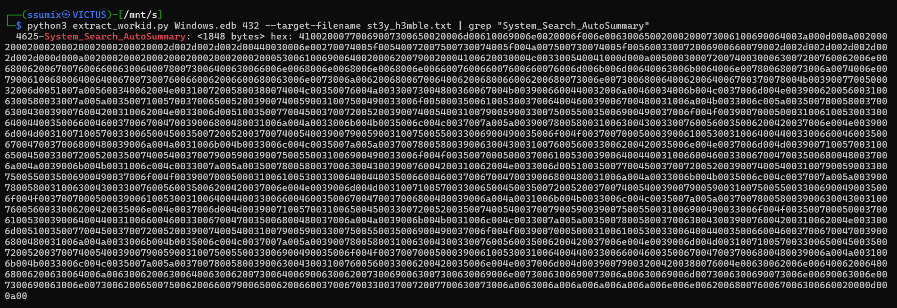

Then I decoded the hex output and decoded it into UTF-16LE to actually read the content

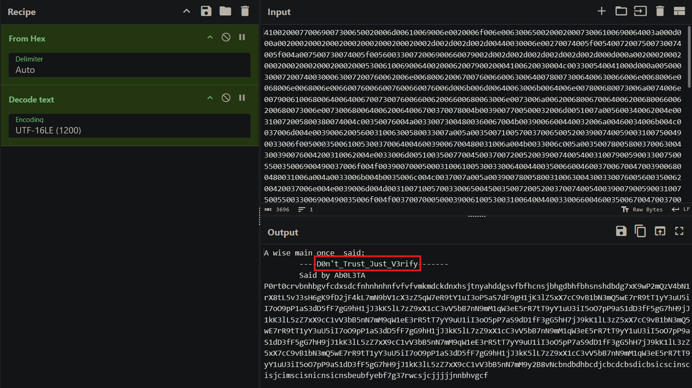

**Answer:** `D0n't_Trust_Just_V3rify`

### Q10: What is the exact creation time of this txt file on the victim machine? Format (YYY-MM-DD HH:MM:SS)

The exact creation time of `St3Y_H3MbLe.txt` can be found in multiple ways, but I chose to parse its `.lnk` file by `LECmd`

```Shell
 ./LECmd.exe -f "path\to\St3Y_H3MbLe.txt.lnk" --json out.json
```

Then I opened the output and noticed the target creation time:

```
{"SourceFile":"",
"SourceCreated":"2026-07-24T13:16:46.6277622+00:00",
"SourceModified":"2026-06-25T02:34:50.0000000+00:00",
"SourceAccessed":"2026-07-25T10:26:05.8407872+00:00",
"TargetCreated":"2026-06-25T02:31:34.5376269+00:00",
"TargetModified":"2026-06-25T02:31:34.5376269+00:00",
"TargetAccessed":"2026-06-25T02:32:12.0998081+00:00",
"FileSize":931,
"RelativePath":"..\\..\\..\\..\\..\\Desktop\\St3Y_H3MbLe.txt",
"WorkingDirectory":"C:\\Users\\mm370\\Desktop",
"FileAttributes":"FileAttributeArchive",
"HeaderFlags":"HasTargetIdList, HasLinkInfo, HasRelativePath, HasWorkingDir, IsUnicode, DisableKnownFolderTracking",
"DriveType":"Fixed storage media (Hard drive)",
"VolumeSerialNumber":"5E716849",
"LocalPath":"C:\\Users\\mm370\\Desktop\\St3Y_H3MbLe.txt",
"TargetIDAbsolutePath":"St3Y_H3MbLe.txt",
"TargetMFTEntryNumber":"0x1CC",
"TargetMFTSequenceNumber":"0x9",
"MachineID":"desktop-57opf17",
"MachineMACAddress":"00:0c:29:11:20:33",
"MACVendor":"VMWARE",
"TrackerCreatedOn":"2026-05-26T23:05:09.7260222+00:00",
"ExtraBlocksPresent":"TrackerDataBaseBlock, PropertyStoreDataBlock"}
```

**Answer:** `2026-06-25 02:31:34`

### Final Flag:

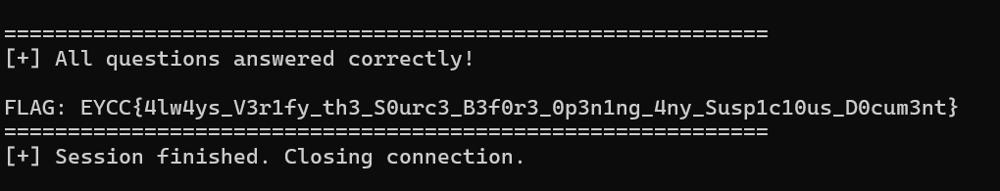

---

And that was all, hope you enjoyed this writeup!! :>
