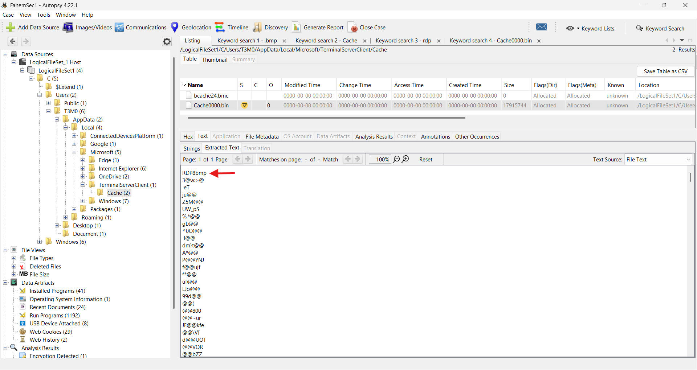
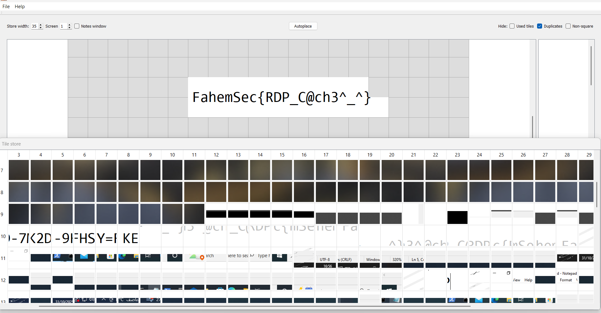
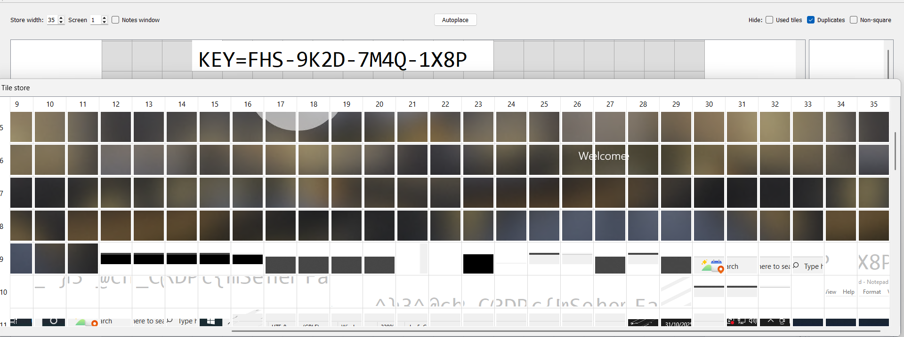
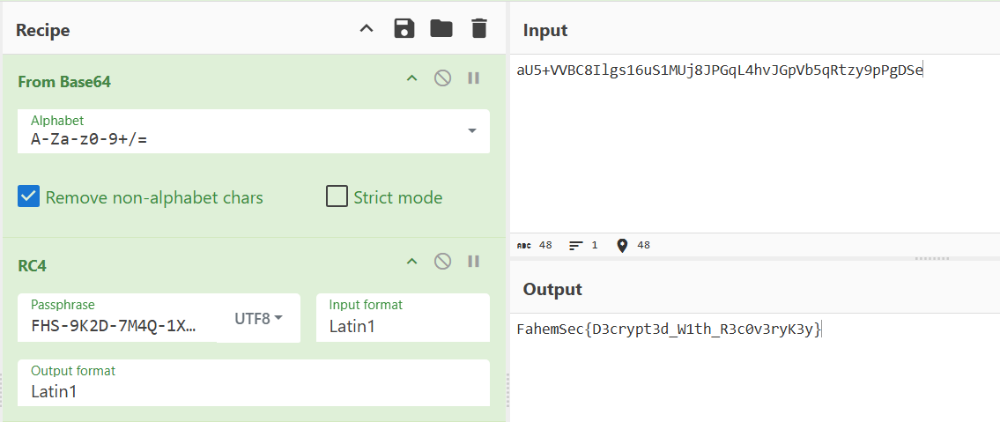
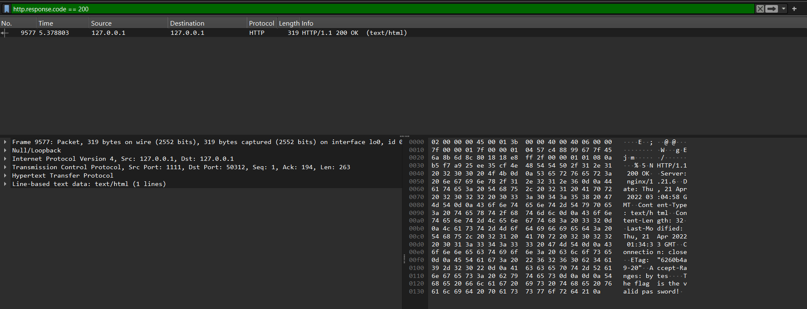
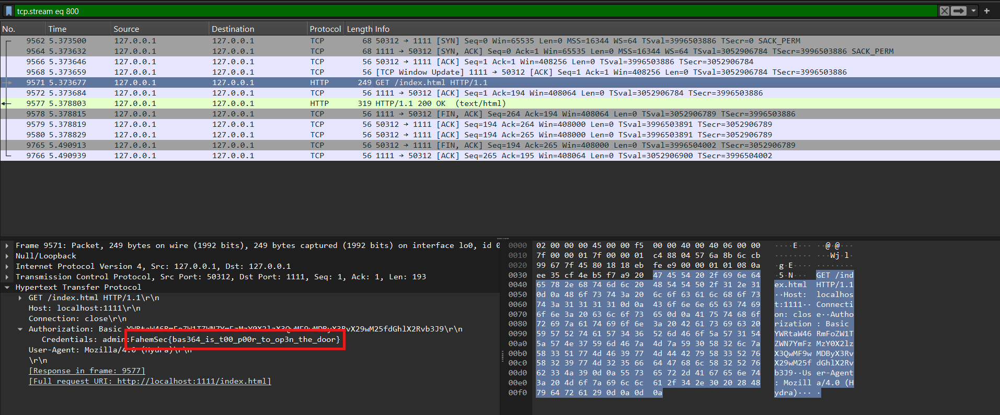
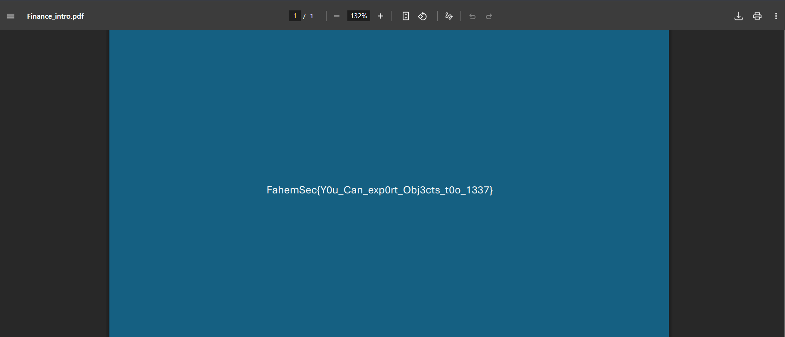

In this write-up, I will cover the FahemSec CTF Challenges I managed to solve including DFIR, Crypto, and Miscellaneous challenges. During the CTF, I had great progress in the disk forensics challenges but then went to sleep >-<  I'll still include them in the write-up though

Anyways, Let's dive-in!

---
## Case 101 Part. 1: DFIR
**Description:** No screenshots were saved, something from the last session might still remain on the disk.

After initial investigations for the provided `.csv` files and the provided C dump, I noticed multiple indications of RDP attempts, and confirmed that after checking this path:
`C\Users\T3M0\AppData\Local\Microsoft\TerminalServerClient\Cache` 

And finding an RDP BMP snippets dump:



I referred back to the challenge's description, this makes sense as this dump contains tiny screenshots of the RDP screen

Then I extracted the BMPs put of the bin file:
```shell
┌──(ssumix㉿VICTUS)-[/mnt/s/DFIR/CTFs/fahem]
└─$ bmc-tools -s "Cache0000.bin" -d "output" -b
[+++] Processing a single file: 'Cache0000.bin'.
[+++] Processing a file: 'Cache0000.bin'.
[===] 1143 tiles successfully extracted in the end.
[===] Successfully exported 1143 files.
[===] Successfully exported collage file.
```

Then I checked the output, and found lotsss of tiny sniplets, so to put them together I used `RdpCacheStitcher`, and manually rearranged the flag parts to get the final flag



---
## Case 101 Part. 2: DFIR
**Description:** The archive opens, the data does not. What you recovered earlier is still relevant.

Ok so during my initial investigations in the last challenge I did notice a password-protected archive and tried to brute-force its password but this didn't work. Thats because the archive's password was in the recovered BMPs from the first part:



I extracted the flag2.txt file from the archive and the flag seemed encrypted:
`aU5+VVBC8Ilgs16uS1MUj8JPGqL4hvJGpVb5qRtzy9pPgDSe`

And after some _really_ good research and confusion with an AI buddy I figured out it was a Base64 encoded RC4 stream cipher that was encrypted with the key we found earlier

So yeah I just used [CyberChef](https://gchq.github.io/CyberChef/) to decrypt the flag



---
## MyData: DFIR
**Description:** Can you get the data ?

After opening the pcap in `Wireshark` and filtering for DNS traffic I immediately noticed something suspicious; a high volume of DNS queries to `fahemsec.com`, each with a different short subdomain that looks like a hex string:

```Sample
4661.fahemsec.com 
6865.fahemsec.com 
6d53.fahemsec.com 
6563.fahemsec.com 
7b44.fahemsec.com 
...
```

This is a textbook DNS Exfiltration signature; the attacker broke their payload into hex chunks and encoded each one as a subdomain label in outbound DNS queries, and since most networks freely allow outbound DNS, this technique can silently bypass firewalls and DLP solutions.

I used `tshark` to filter for DNS requests only (`dns.flags.response == 0`), target our domain, and carve out just the subdomain portion:

```bash
tshark -r data.pcapng \ 
-Y 'dns.flags.response == 0 && dns.qry.name contains "fahemsec.com"' \ 
-T fields -e dns.qry.name \ 
| awk -F. '{print $1}' \ 
| awk '!seen[$0]++'
```

The output was:

```
4661 6865 6d53 6563 7b44 4e53 5f45 7866 696c 7472 6174 696f 6e5f 3173 5f52 3361 6c7d
```

Then I quickly decoded the hex sequence using python:

``` python
hex_data = [
    "4661", "6865", "6d53", "6563", "7b44", "4e53", "5f45", "7866",
    "696c", "7472", "6174", "696f", "6e5f", "3173", "5f52", "3361", "6c7d"
]

flag = "".join(bytes.fromhex(h).decode('ascii') for h in hex_data)
print(flag)
```

And the final flag was: `FahemSec{DNS_Exfiltration_1s_R3al}`

---
## Plane: DFIR
**Description:** Some protocols are more transparent than they appear.

After going through the pcap in `Wireshark`, I noticed alot of failed `GET` requests, with admin credentials in the headers, and it seamed like a brute-force attack. So my first step was to filter for the successful requests by using this filter: `http.response.code == 200`



And after following the `HTTP` stream I found the flag in the successful `GET` request's header!



---
## Top Secret: DFIR
**Description:** Can you get my secret from these packets?

I opened the file in Wireshark and started scrolling through the packets, and the first thing that caught my eye was at the bottom of the capture. The traffic ends with a flood of repeated unanswered ARP requests:

```
VMware_c0:00:08  →  ARP  "Who has 192.168.44.2? Tell 192.168.44.1"
VMware_c0:00:08  →  ARP  "Who has 192.168.44.2? Tell 192.168.44.1"
VMware_c0:00:08  →  ARP  "Who has 192.168.44.2? Tell 192.168.44.1"
(no reply...)
```

ARP is how devices on a local network find each other. The repeated requests with no answer means `192.168.44.2` went offline or disconnected. But more importantly, this told me the environment: a local VMware network on the `192.168.44.x` subnet, with `192.168.44.147` being the only active host worth focusing on.

With the local IP identified, I filtered traffic to and from that machine:

```
http && ip.addr == 192.168.44.147
```

The filtering immediately showed two things happening:
- First, sequential `GET /user/22`, `/user/23`, `/user/24`, `/user/25` requests against a JSON API on port 9090 (IDOR enumeration by an automated tool).
- Second, further down, a `GET /Finance_intro.pdf HTTP/1.1` request followed immediately by a `200 OK (application/pdf)` response. That's the file transfer we care about :3

Wireshark can reconstruct files from HTTP traffic automatically. I went to:

```
File → Export Objects → HTTP
```

`Finance_intro.pdf` appeared in the list. I saved it, we now have the actual file that was transferred, which had the flag



---
## Decoder: Crypto


We were asked to decode this photo, and after some reverse image search I found that this was an alphabet called "Pokémon Go Unknown"


So I decoded the text according to this alphabet and the final flag was `EASYFLAGLEET`

---
## oneROX: Crypto

The chall's name indicates that it's a single-byte XOR challenge, so I just made a quick script that brute-forces the flag:

``` python
cipher_hex = "63425948170d6b4c4548407e484e561515181a1a1b1f4c4e1a4c48494f494f4e1e1449481a1a484c1a1d1a181518155027"

cipher = bytes.fromhex(cipher_hex)

for key in range(256):
    decrypted = bytes([b ^ key for b in cipher])
    try:
        text = decrypted.decode(errors="ignore")
        if "FahemSec{" in text:
            print(f"[+] Key found: {key} (0x{key:02x})")
            print(text)
            break
    except:
        continue
```

and found the flag:
```
[+] Key found: 45 (0x2d)
Note: FahemSec{8857762ac7aedbdbc39de77ea7075858}
```

---

## Rookie: Misc
**Description:** While Developing our platform on the early stage we wanted to test admin panel in production without being crawled by bots online , so our developer suggested to use a very random subdomain name to avoid that, seems he was a rookie !

Okay so after some research I found alot of tools that can get the subdomains of a given domain, so I just used [this one](https://crt.sh/)

``` bash
┌──(ssumix㉿VICTUS)-[~]
└─$ curl "https://crt.sh/?q=%25.fahemsec.com&output=json" | grep admin
```

And found the subdomain `admin-portal-09c097fa23`

So final flag becomes:
`FahemSec{admin-portal-09c097fa23}`

---

And yeah that was all, hope you had fun reading this writeup! :>
