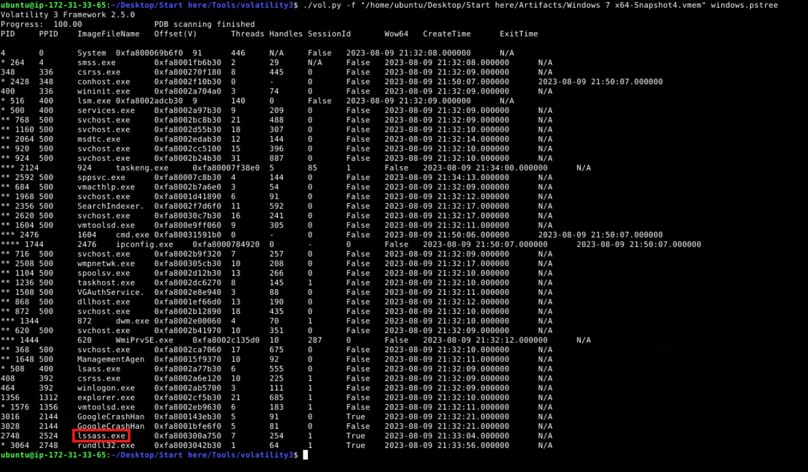
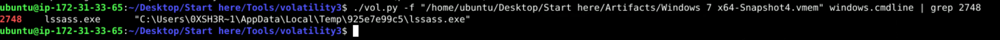
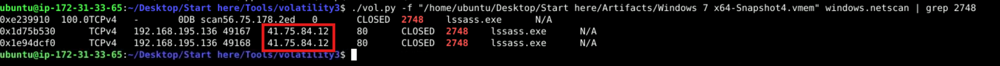
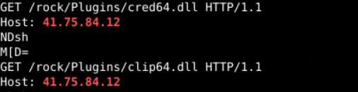
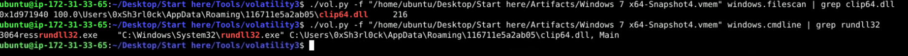
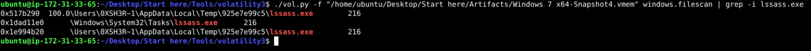

--- 
title: Amadey-APT-C-36 Lab Cyberdefenders Lab Writeup 
published: 2026-06-01 
pinned: false 
description: A detailed writeup for Amadey-APT-C-36 lab on Cyberdefenders 
tags: [DFIR, Memory Forensics, Write-up, labs]
category: Write-ups 
author: 0xSky 
draft: false 
---
# Amadey - APT-C-36 Lab
Lab Scenario: An after-hours alert from the Endpoint Detection and Response (EDR) system flags suspicious activity on a Windows workstation. The flagged malware aligns with the Amadey Trojan Stealer. Your job is to analyze the presented memory dump and create a detailed report for actions taken by the malware.

---
### Q1: In the memory dump analysis, determining the root of the malicious activity is essential for comprehending the extent of the intrusion. What is the name of the parent process that triggered this malicious behavior?

After viewing the process using the `pstree` plugin to understand relations between processes, I noticed a suspicious process:

The `lssass.exe` process caught my eye as it mimics the legitimate Windows process `lsass.exe` (Local Security Authority Subsystem Service). It also has a child process `rundll32.exe`, which is commonly abused by malware to execute malicious DLLs, making `lssass.exe` highly suspicious.

**Answer:** `lssass.exe`

### Q2: Once the rogue process is identified, its exact location on the device can reveal more about its nature and source. Where is this process housed on the workstation?

To get the location of the malicious process I used the `cmdline` plugin and grepped for `lssass.exe` 's PID: **2748**.

Another approach was grepping the PID from the `filescan` plugin output, which also revealed the malicious process's path.

**Answer:** `C:\Users\0XSH3R~1\AppData\Local\Temp\925e7e99c5\lssass.exe`

### Q3: Persistent external communications suggest the malware's attempts to reach out C2C server. Can you identify the Command and Control (C2C) server IP that the process interacts with?

For this question, I used the `netscan` plugin to check network connections made by the system and grepped for the malicious process's PID to identify the IP address it communicated with:

**Answer:** `41.75.84.12`

### Q4: Following the malware link with the C2C, the malware is likely fetching additional tools or modules. How many distinct files is it trying to bring onto the compromised workstation?

Since the communication between the malware and the attacker happened over port **80**, the traffic was unencrypted, meaning the raw HTTP requests could potentially be recovered from memory. So I used `strings` on the memory dump and filtered out for the attacker's IP and 2 lines before and after it to view the full request:

And found two `GET` requests showing the malware downloading the files `cred64.dll` and `clip64.dll`.

**Answer:** `2`

### Q5: Identifying the storage points of these additional components is critical for containment and cleanup. What is the full path of the file downloaded and used by the malware in its malicious activity?

Since we already identified `clip64.dll` in Q4, I searched for it in the `filescan` output to locate its path. Another way to confirm this was by checking the command line arguments of the child process `rundll32.exe`, which revealed the DLL being executed:

**Answer:** `C:\Users\0xSh3rl0ck\AppData\Roaming\116711e5a2ab05\clip64.dll`
### Q6: Once retrieved, the malware aims to activate its additional components. Which child process is initiated by the malware to execute these files?

We actually noted the answer to this question from the very beginning. The child process of the malware was clear from `pstree` 's output to be `rundll32.exe`

**Answer:** `rundll32.exe`

### Q7: Understanding the full range of Amadey's persistence mechanisms can help in an effective mitigation. Apart from the locations already spotlighted, where else might the malware be ensuring its consistent presence?

I grepped for the malicious executable's name in the `filescan` output and found three paths:

The first path was the primary location of the file, which we had already seen before. The second path was inside the Windows Tasks directory, suggesting a persistence mechanism that would automatically execute the malware at startup or user logon. The third path was located in the Temp directory, which wasn't particularly interesting.
**Answer:** `C:\Windows\System32\Tasks\lssass.exe`

---
### Conclusion

During the investigation, I identified `lssass.exe` as the initial malicious process. It communicated with the C2 server at `41.75.84.12`, downloaded additional DLL payloads, executed them using `rundll32.exe`, and established persistence through a scheduled task.

And that's it! Thanks for reading, and don't forget to check out my other writeups :>
