**Lab Scenario:** After Karen started working for **TAAUSAI**, she began performing illegal activities inside the company. TAAUSAI hired you as a SOC analyst to investigate the case. A disk image was acquired, and it was found that Karen used a Linux operating system on her machine. Analyze the disk image and answer the provided questions.

We are given an `.ad1` disk image file, which I opened in **FTK Imager** to start my investigation.

---

### Q1: Which Linux distribution is being used on this machine?

After loading the disk image, I checked the provided directories: `boot`, `root`, and `var`. I started with the `boot` directory, looking for indicators of the Linux distribution. I noticed that all of the boot files had Kali-related names, which confirmed that the operating system being used was **Kali Linux**.

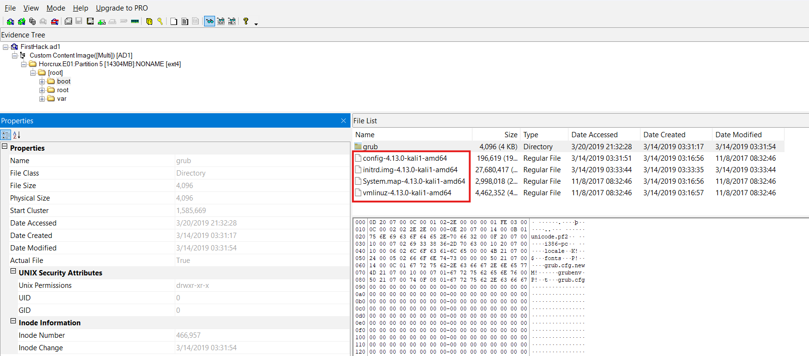

**Answer:** `kali`

### Q2: What is the MD5 hash of the Apache `access.log` file?

I navigated to the `access.log` file located under `/var/log/apache2`. **FTK Imager** automatically calculated the file's MD5 hash, which I used as the answer.

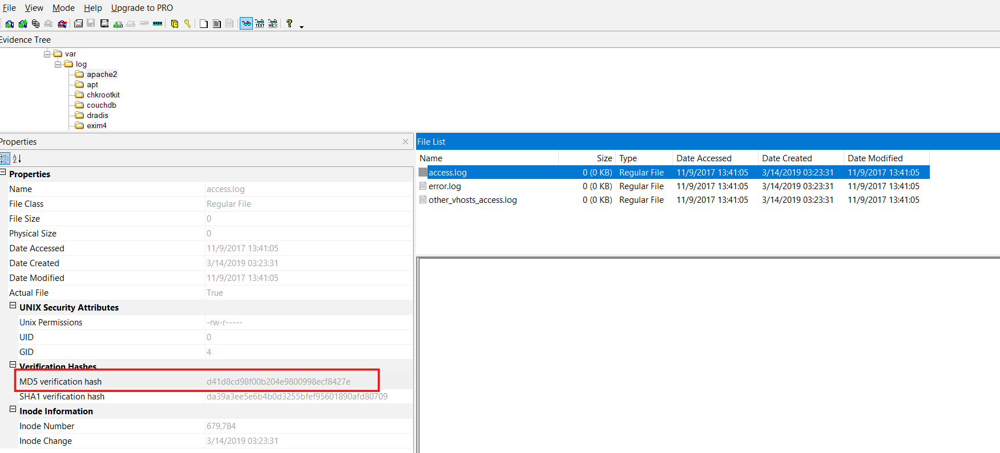

**Answer:** `d41d8cd98f00b204e9800998ecf8427e`

### Q3: It is suspected that a credential dumping tool was downloaded. What is the name of the downloaded file?

I headed to the `/Downloads` directory and found a ZIP archive named `mimikatz_trunk.zip`. After checking its contents, I found a `README.md` file that clearly described **Mimikatz** as a credential dumping tool capable of extracting plaintext passwords, hashes, PINs, and Kerberos tickets from memory.

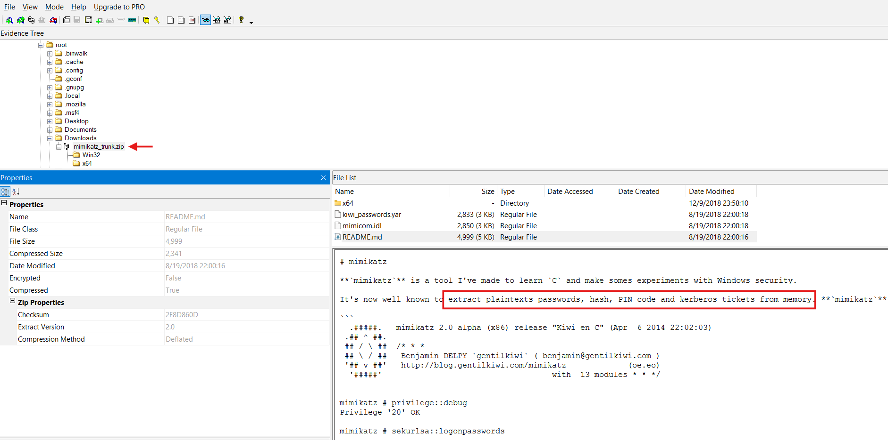

**Answer:** `mimikatz_trunk.zip`

### Q4: A super-secret file was created. What is the absolute path to this file?

To identify files created by the user, I checked the `.bash_history` file for any file creation commands that might reveal the secret file's location. I found the command responsible for creating the file, which contained its absolute path.

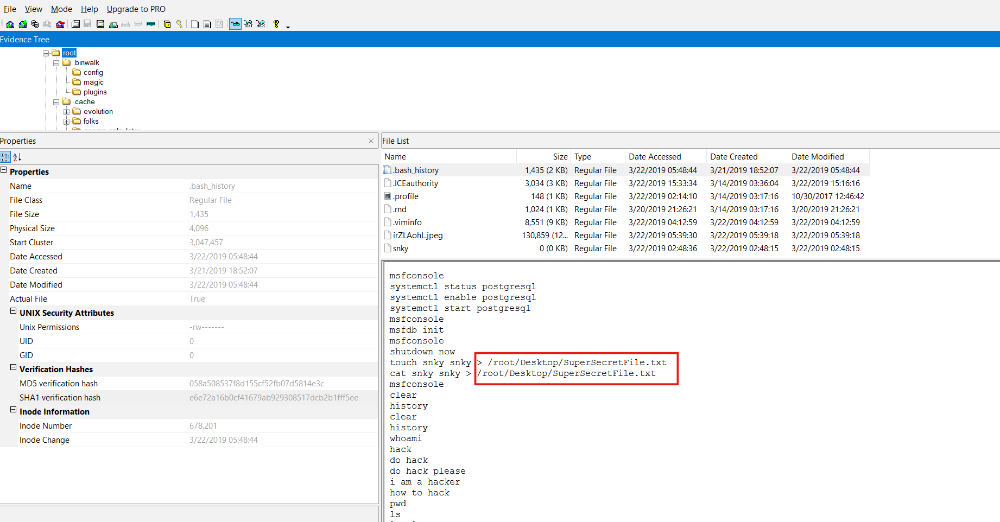

**Answer:** `/root/Desktop/SuperSecretFile.txt`

## Q5: What program used the file `didyouthinkwedmakeiteasy.jpg` during its execution?

I checked `.bash_history` again and searched for any commands referencing `didyouthinkwedmakeiteasy.jpg`. I found the command:

`binwalk didyouthinkwedmakeiteasy.jpg`

This confirmed that the program used to analyze the file was **binwalk**.

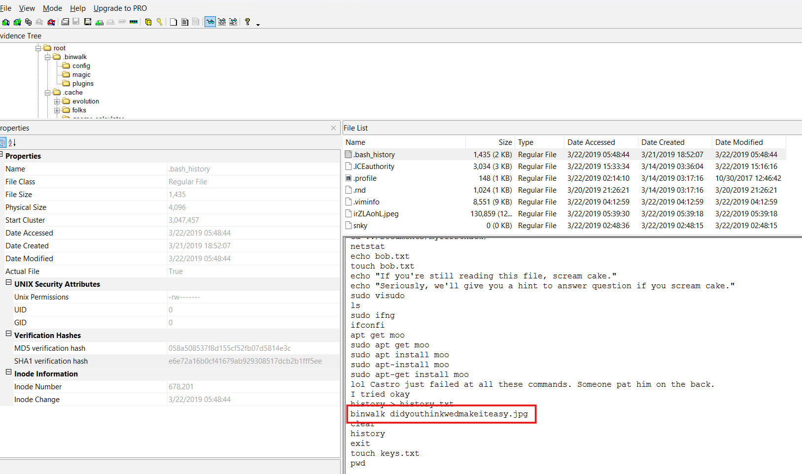

**Answer:** `binwalk`

## Q6: What is the third goal from the checklist Karen created?

I checked the `/Desktop` directory, which contained a folder named `mimikatz` and a file named `Checklist`. After viewing the contents of the checklist, I found three listed goals. The third goal was **Profit**.

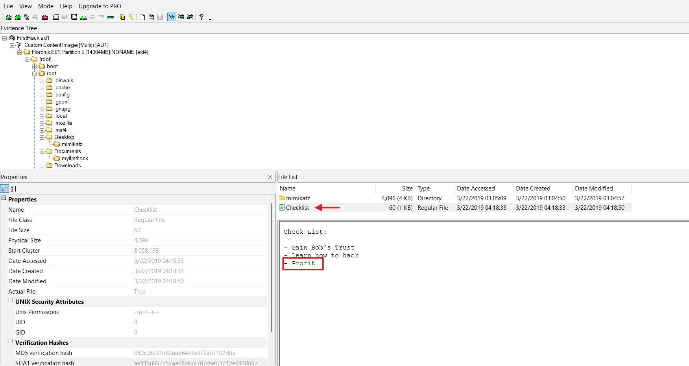

**Answer:** `Profit`

## Q7: How many times was Apache run?

I checked the Apache `access.log` file again, and it appeared to be empty. Since there were no logged requests, this indicated that Apache had not been used.

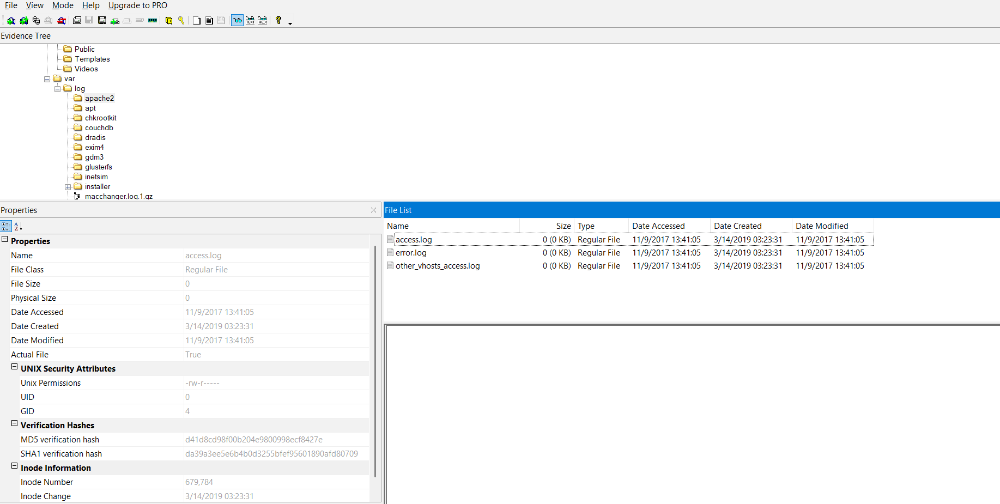

**Answer:** `0`

## Q8: This machine was used to launch an attack on another. Which file contains the evidence for this?

Ooookay, after looking through the `/root` directory again, I noticed an image with a weird name. After opening it, I saw that it was a screenshot showing malicious commands being executed with administrative privileges, indicating that the machine had been used to perform an attack.

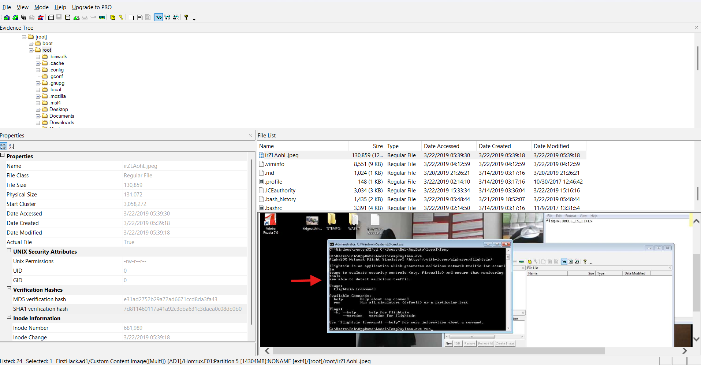

**Answer:** `irZlAohL.jpeg`

## Q9: It is believed that Karen was taunting a fellow computer expert through a bash script within the Documents directory. Who was the expert that Karen was taunting?

I headed to the `/Documents` directory and checked the contents of the `myfirsthack` folder. I noticed that the `firstscript_fixed` file contained a line directly mentioning someone's name.

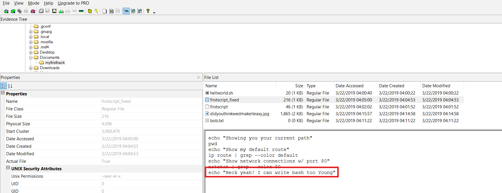

**Answer:** `Young`

## Q10: A user executed the `su` command to gain root access multiple times at 11:26. Who was the user?

To investigate the execution of the `su` command and privilege escalation attempts, I checked the `auth.log` file under `/var/log`. Since the log was quite large, I focused only on the entries around the `11:26` timestamp.

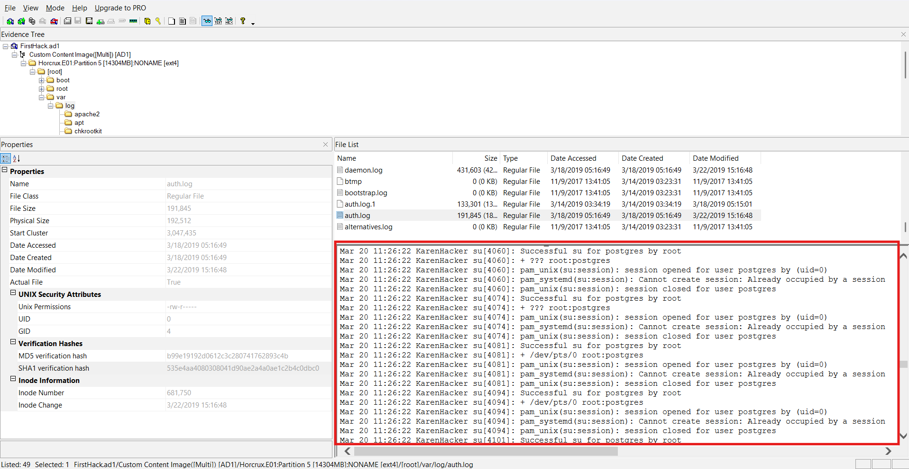

The log revealed that the user `postgres` executed the `su` command multiple times during that period.

**Answer:** `postgres`

## Q11: Based on the bash history, what is the current working directory?

I checked `.bash_history` once again and found several `cd` commands. The last `cd` command is a good indicator of the current working directory, so I used its destination as the answer.

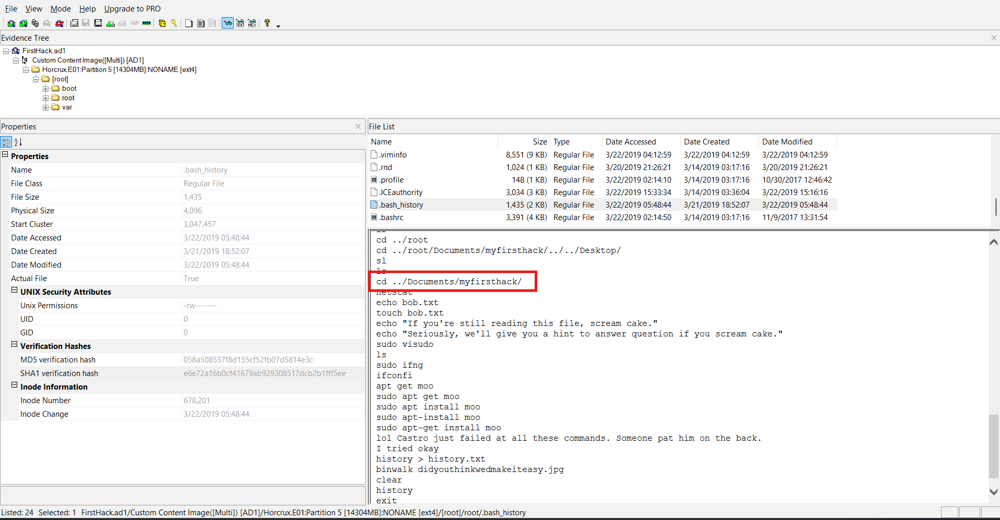

**Answer:** `/root/Documents/myfirsthack/`

---
And that was all! Hope you enjoyed reading this writeup <:
