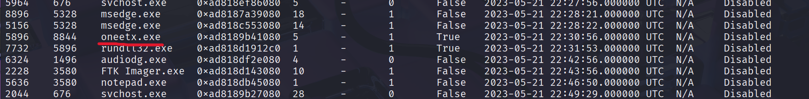
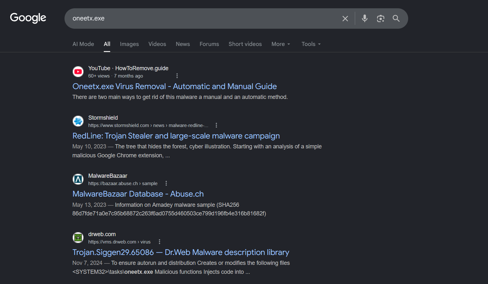
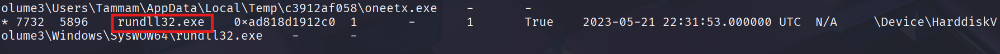
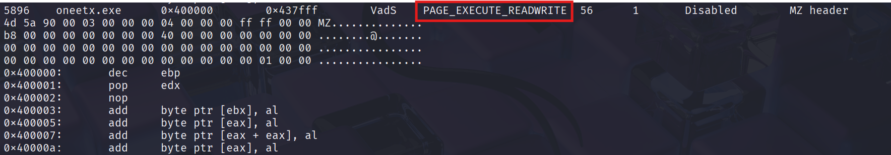
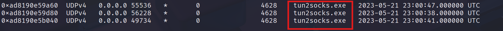
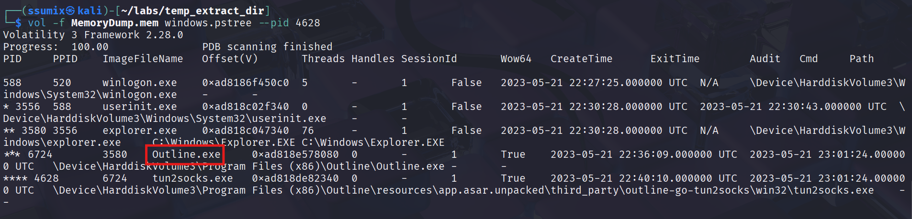
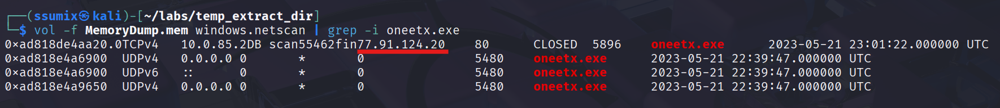
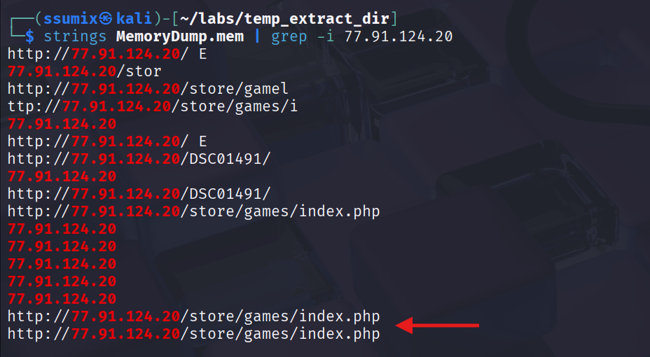
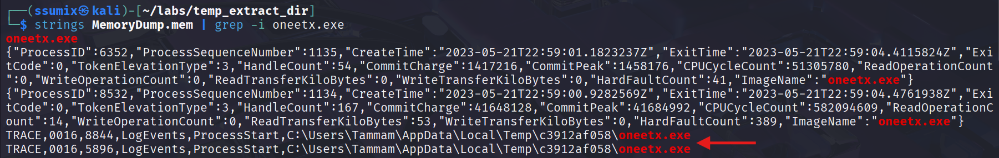

**Lab scenario:** As a member of the Security Blue team, your assignment is to analyze a memory dump using Redline and Volatility tools. Your goal is to trace the steps taken by the attacker on the compromised machine and determine how they managed to bypass the Network Intrusion Detection System (NIDS). Your investigation will identify the specific malware family employed in the attack and its characteristics. Additionally, your task is to identify and mitigate any traces or footprints left by the attacker.

---
### Q1: What is the name of the suspicious process?

I first listed all processes by the `pslist` plugin in Volatility 3:
```shell
vol -f MemoryDump windows.pslist
```
And from all processes, one process caught my eye:

It didn't resemble a standard Windows process or any legitimate application I recognized, and after researching the process name, my suspicions were confirmed:

**Answer:** oneetx.exe

### Q2: What is the child process name of the suspicious process?

To get the child process name I used the `pstree` plugin to see relations between processes:
```shell
vol -f MemoryDump windows.pstree
```
And from `pstree` 's output, it's clear that the child process of the malicious process `oneetx.exe` is `rundll32.exe`:

**Answer:** rundll32.exe

### Q3: What is the memory protection applied to the suspicious process memory region?

Protection method can be found by `malfind` plugin that helps find hidden or injected code/DLLs in user-mode memory, based on characteristics such as VAD tag and page permissions:
```shell
vol -f MemoryDump windows.malfind
```

`PAGE_EXECUTE_READWRITE` in the protection field means that the process has all permissions: read, write, and execute, which are needed for the malware to do its job

**Answer:** PAGE_EXECUTE_READWRITE

### Q4: What is the name of the process responsible for the VPN connection?

To check network connections made by the device, I used the `netscan` plugin:
```shell
vol -f MemoryDump windows.netscan
```
And found nothing really interesting in the connections other than some connections made by the malicious file `oneetx.exe`, but after examining the output more carefully, I noticed several suspicious connections: 

After a bit of research, I found out that they were actually related to VPN services:

So I looked up its PID in `pstree`'s output to see which process it belonged to:

And we can clearly see that it is a child process of `Outline.exe`.

**Answer:** Outline.exe

### Q5: What is the attacker's IP address?

If we go back to `netscan` 's output we'll find the attacker's IP in the connection made by the malicious process `oneetx.exe`:


**Answer:** 77.91.124.20

### Q6: What is the full URL of the PHP file that the attacker visited?

I used `strings` on the memory dump and filtered out for php using `grep` but the output was huge, so instead I filtered out the output for the attacker's IP address 

And the output revealed the full URL visited by the attacker!

**Answer:** http://77.91.124.20/store/games/index.php

### Q7: What is the full path of the malicious executable?

To get the full path of `oneetx.exe` I just used `strings` again on our memory dump and grepped the executable's name:

Other approaches would be dumping the process, or using the `filescan` plugin to get the file path

**Answer:** C:\Users\Tammam\AppData\Local\Temp\c3912af058\oneetx.exe

---
And that was all, don't forget to check my other writeups! 

Hope you enjoyed <3
